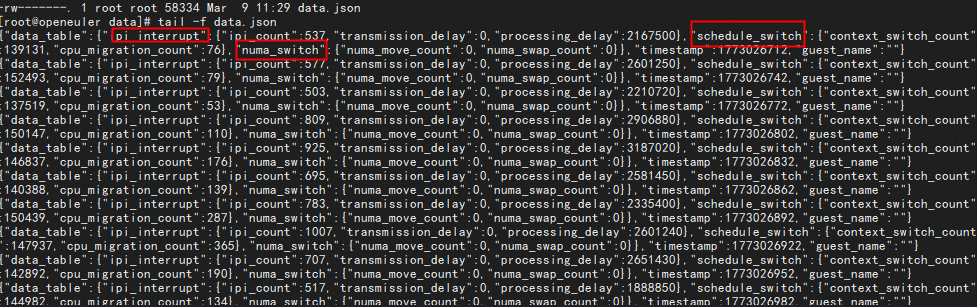
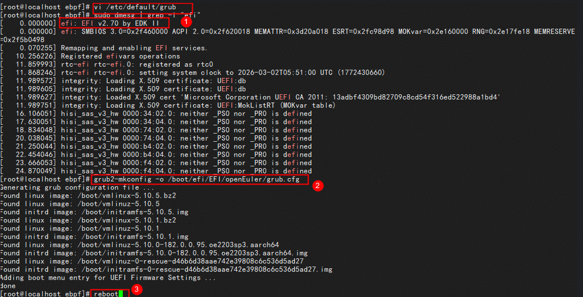
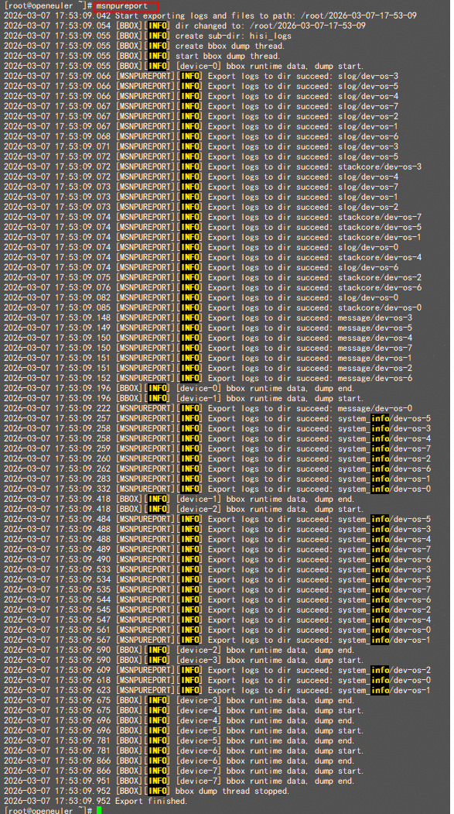
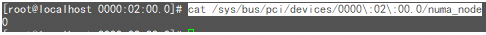
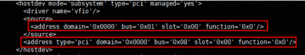

# UBS virt-optimizer 用户指南

## 介绍

`ubs-optimizer`是基于C++语言开发的，在昇腾虚拟化场景下针对虚拟机性能优化的调优工具。

本章内容旨在帮助开发者快速掌握ubs-optimizer的核心功能以及适用场景，提供可直接运行的代码，并规避常见问题。

## 前置条件

1. 使用ubs-optimizer服务及功能前需确定环境为虚拟化智算场景且满足ubs-optimizer环境要求：
  
    - 判断是否为虚拟机智算场景，具体可参考[性能优化方法](#性能优化方法)中的应用场景。
    - 判断是否为满足ubs-optimizer环境要求，具体可参考[部署说明](./virt_optimizer_installation.md)中的应用场景。

2. 使用ubs-optimizer服务及功能前需完成ubs-optimizer的环境准备与安装准备, 参考[部署说明](./virt_optimizer_installation.md)中的软件安装。

## ubs-optimizer 业务部署与启动

1. 获取ubs-optimizer最新的rpm包，并安装到系统。

    - ARM架构操作系统
      
      ```bash
      rpm -ivh ubs-optimizer-0.1.0-k5.1-aarch64.rpm
      ```

    - x86架构操作系统

      ```bash
      rpm -ivh ubs-optimizer-0.1.0-k5.1-x86_64.rpm
      ```

    预期输出示例如下：

    ```shell
    [root@localhost ljj]# rpm -ivh ubs-optimizer-0.1.0-k5.1-aarch64.rpm
    Verifying...                          ################################# [100%]
    Preparing...                          ################################# [100%]
    Checking BPF configs...
    CONFIG_BPF enabled (CONFIG_BPF=y)
    CONFIG_BPF_SYSCALL enabled (CONFIG_BPF_SYSCALL=y)
    CONFIG_BPF_EVENTS enabled (CONFIG_BPF_EVENTS=y)
    CONFIG_BPF_JIT enabled (CONFIG_BPF_JIT=y)
    Your kernel is ready.
    Checking vsock config...
    OK
    Updating / installing...
      1:ubs-optimizer-0.1.0-k5.1         ################################# [100%]
    ```

## 配置调优工具配置项

1. 配置config.json文件。

   a. 编辑"/use/local/sbin/ubs-optimizer/config.json"文件。
    
      ```bash
      vi /usr/local/sbin/ubs-optimizer/config.json
      ```
  
   b. 修改内容示例如下，eBPF指标采集配置参数说明如[配置参数说明](#table1)所示。

        ```json
        {
          "sampling_interval": 30,
          "bind_port": 10101,
          "vm_name": "openeuler",
          "npu_type": "d802",
          "system" : {
              "ipi_collection": "enable",
              "sched_collector": "enable",
              "numa_collector": "enable"
          }
        }
        ```

      **表 1** 参数说明<a id="table1"></a>

      | 参数名 | 取值 | 说明 | 备注 |
      |------|------|------|------|
      | sampling_interval | 取值范围：[1,600]<br>默认：30<br>单位：s | 采集周期 | 需为整数 |
      | bind_port | 取值范围：[1024,49151]<br>默认：10101 | 服务侦听端口 | - |
      | vm_name | 默认：openeuler | 虚拟机实例名称 | - |
      | npu_type | 取值：{d802, d803} | NPU设备标识符 | A2 使用 d802<br>A3 使用 d803 |
      | system-ipi_collector | 取值：{enable, disable}<br>默认：enable | 启用处理器间中断（IPI）监控 | enable：启用<br>disable：关闭 |
      | system-sched_collector | 取值：{enable, disable}<br>默认：enable | 启用进程调度器分析 | enable：启用<br>disable：关闭 |
      | system-numa_collector | 取值：{enable, disable}<br>默认：enable | 启用 NUMA 内存访问监控 | enable：启用<br>disable：关闭 |

      > 说明
      >
      > - 尽可能将表 eBPF指标采集配置说明中的{system-ipi_collector，system-sched_collector，system-numa_collector}全部启用，错误的数据会导致调优项判断异常。
      > - 虚拟机和物理机的正常通信要求配置免密和主机名解析。
      
   c. 保存配置文件。

2. 进入虚拟机，启动eBPF采集进程。

    ```bash
    ubs-opt start_ebpf
    ```

3. 采集一段时间后，在虚拟机里停止eBPF采集进程。

    ```bash
    ubs-opt stop_ebpf
    ```

4. 采集结束后，将虚拟机中采集的数据“/var/ubs-opt/data/data.json”拷贝至物理机“/var/ubs-opt/data/”路径下。性能数据示例如下图所示：

    

5. 在host上启动性能优化器。

    ```bash
    ubs-opt-tuner start
    ```

UBS Optimizer会对虚拟机的性能数据进行分析，并列出可执行的优化项，用户可选择需要的优化项，参考[性能优化方法](#性能优化方法)，手动配置优化。

## 示例

示例的部署及使用场景为：昇腾NPU+鲲鹏CPU的协同计算架构场景，执行以下操作进行性能调优。

1. 虚拟机和物理机部署ubs-optimizer，完成配置文件配置。
2. 虚拟机性能数据采集，并拷贝数据至物理机“/var/ubs-opt/data/”路径。
3. 启动调优器进程。

    ```bash
    ubs-opt-tuner start
    ```

    ubs-optimizer分析虚拟机的性能数据后，会给出优化建议。如下图所示：

    

4. 根据当前应用场景在[性能优化方法](#性能优化方法)中，找到对应的优化描述。

      [性能优化方法](#性能优化方法)中，对应的优化项为GICv4.1以及HugePage 2M优化。

5. 评估后，选择配置GICv4.1优化项，并手动配置GICv4.1优化项，配置操作如下：

    a.修改宿主机的/etc/default/grub，在GRUB_CMDLINE_LINUX项的末尾加入以下参数：

      ```shell
      kvm-arm.vgic_v4_enable=1
      ```

      

    b.修改完成后，查看宿主机启动方式，执行对应命令，重新生成`GRUB2`的启动配置文件，并重启操作系统。

      

    c.重启宿主机后，执行以下命令，存在回显，则说明配置成功。

      ```bash
      cat /proc/cmdline | grep vgic_v4_enable
      ```

## 应用场景

当前ubs-optimizer支持以下两种场景：

**场景1：昇腾NPU+鲲鹏CPU的协同计算架构场景**

该场景有如下限制：

|项目|版本信息|
|:----|:----|
|架构|ARM架构，鲲鹏型号CPU，昇腾型号NPU|
|操作系统|openEuler 22.03 LTS SP4|
|NPU驱动|Ascend HDK 24.1.1及以上|
|软件版本|<ul><li>Libvirt v9.4及以上</li><li>QEMU v8.1及以上</li></ul>|
|硬件要求|<ul><li>Atlas 900 A3 SuperPoD 超节点A900</li><li>A3 SuperPoD 超节点</li><li>Atlas 800T A2 训练服务器</li><li>A800T A2 训练服务器</li></ul>|

**场景2：昇腾NPU+X86架构CPU的协同计算架构场景**

该场景有如下限制：

|项目|版本信息|
|:----|:----|
|架构|X86架构，昇腾型号NPU33|
|操作系统|TencentOS Server 3.1|
|NPU驱动|Ascend HDK 25.3.RC1及以上|
|软件版本|<ul><li>Libvirt v9.4及以上</li><li>QEMU v8.1及以上</li></ul>|
|硬件要求|G8600服务器|

## 性能优化方法

### 场景1：昇腾NPU+鲲鹏CPU的协同计算架构场景

#### WriteCombine优化

- 原理介绍

  `WC`（Write Combining，写合并）是一种提升主机向非缓存PCIe设备写入性能的技术。写入WC区域的数据会暂存于64字节缓冲区，待缓冲区填满或触发刷新事件（如写入地址超出当前缓冲区范围）时，执行合并写入，显著提升总线利用率，实现更高吞吐量。该特性在当前约束限制下的物理机上默认开启，本章节主要指导用户如何开启虚拟机内的WC特性，用户需要修改物理机内核代码、QEMU代码后重新编译安装。

- 配置方法
  
  1. 虚拟机内验证write combing是否开启。

      确保虚拟机内安装了NPU Driver驱动，可以通过`npu-smi info`查询到所有NPU信息。

      ```bash
      npu-smi info
      ```

      

      执行以下命令会在当前执行目录下生成例如"yyyy-MM-dd-HH-mm-ss"的日志目录。
      
      ```bash
      msnpureport
      ```

      

      ```bash
      grep -nr "Device capability info" <日志目录名称>
      ```

      

      发现“feature_bar_mem=1”内容，即表示write combing已开启。

      
  2. 配置QEMU。
      - 若write combing已开启，则环境上的qemu不需要打patch。
      - 若write combing未开启，参考[Write Combining性能优化](https://www.hiascend.com/document/detail/zh/Atlas%20200I%20A2/2550/re/virtualmachineconfiguration/topic_0000002482818233.html)，修改内核以及QEMU代码实现该优化。

#### cpu绑核优化

- 原理介绍
  
  CPU一对一绑核能换来vCPU稳定、低延迟和更高缓存命中率，降低调度开销，提高虚拟机的性能;CPU绑核会牺牲物理机CPU的弹性和利用率，需要用户自行权衡资源利用率和虚拟机的性能。

- 配置方法

  1. 进入虚机执行命令，打开并修改虚机的XML定义文件

      ```bash
      # 此处<vm_name>为用户虚拟机名称
      virsh edit <vm_name>
      ```

  2. 手动配置每一个cpuset（物理CPU）唯一对应一个vCPU（虚拟CPU）。
      
      示例：物理机上CPU编号有0-191

      

      虚拟机XML中配置`cputune`，配置192个`vcpupin`,其中cpuset依次为0-191，vCPU依次为0-191，cpuset与vcpu一一对应。

      

  3. 保存xml修改的内容并重启虚拟机。

      ```bash
      virsh reboot openeuler
      ```

#### NUMA NPU亲和绑定

- 原理介绍

  物理机上NPU与NUMA之间存在亲和关系，令NPU优先使用同一个NUMA节点内的CPU；将该特性在虚拟机内使能，与物理机保持一致，不影响正常业务场景。

- 配置方法

  1. 获取物理机上NPU的PCI号。

      ```bash
      lspci | grep d802 
      # 其中A2为d802，A3为d803
      ```

      示例如下：

      

  2. 在XML中查询物理机的PCI和虚拟机的PCI对应关系。

      执行以下命令，通过source内address中的bus来找到该NPU对应的虚拟机映射PCI，因为该bus是和步骤1的PCI号一一对应，比如第一个NPU的PCI号是01:00.0，这里`bus`就是0x01,<`Device`>.<`Function`>为00.0

      ```bash
      virsh edit <vm_name>
      # 此处<vm_name>为用户虚拟机名称
      ```

      示例如下：

      
  3. 查看物理机NPU的NUMA号。

      ```bash
      cd /sys/bus/pci/devices
      cat <domain>\:<Bus>\:<Device>.<Function>/numa_node
      ```

      其中，

      ```xml
      <domain>\:<Bus>\:<Slot>.<Function>
      ```

      是根据lspci得到的PCI号。
      示例如下：

      ```shell
      01:00.0 Processing accelerators: Huawei Technologies Co., Ltd. Device d802 (rev 20)
      ```

      此处01:00.0设备，domain为0000，Bus为01，Slot.Function为00.0;
      
      查看其NUMA号：

      ```bash
      cat /sys/bus/pci/devices/0000\:02\:00.0/numa_node
      ```

      

      上图说明该设备在物理机上绑定的numa为0

  4. 进入到虚拟机中/sys/bus/pci/devices目录下，查看该NPU在虚拟机上的绑定的NUMA，返回信息-1，即表示现在还没有绑定

      ```bash
      cd /sys/bus/pci/devices
      cat <domain>\:<Bus>\:<Device>.<Function>/numa_node
      ```

      示例如下：

      

      虚拟机xml中hostdev字段中，直通的NPU设备PCI地址中，domain为0000，Bus为08，Slot.Function为00.0
      
      查看其NPU设备绑定numa：

      ```bash
      cd /sys/bus/pci/devices
      cat 0000\:08\:00.0/numa_node
      ```

      

  5. 为虚机上没绑定NUMA的NPU，绑定相应的NUMA，建议一一对应。

      ```bash
      echo "<numa_num>"> /sys/bus/pci/devices/<domain>\:<Bus>\:<Slot>.<Function>/numa_node
      cat <domain>\:<Bus>\:<Slot>.<Function>/numa_node
      ```

      其中，

      ```bash
      <domain>\:<Bus>\:<Slot>.<Function>
      ```

      为虚拟机的NPU设备地址，numa_num为物理机上与虚拟机一一对应的NPU设备，将虚拟机上NPU设备绑定的NUMA配置为与物理机一致。

  6. 重复以上操作，在虚拟机中，为所有直通虚拟机的NPU绑定NUMA，能够有效减少性能劣化。

#### Halt-Poll

- 原理介绍

  通过修改虚拟机中guest_halt_poll_allow_shrink、cpuidle_haltpoll和guest_halt_poll_ns配置项，能够减少VM-exit/entry次数，降低唤醒延迟；但物理机上分配给虚拟机的CPU会被占用更多、功耗上升，该优化项每次虚拟机重启失效。

- 配置方法

  在虚拟机中执行以下操作：

  ```bash
  echo Y > /sys/module/cpuidle_haltpoll/parameters/force
  echo 2000000000 > /sys/module/haltpoll/parameters/guest_halt_poll_ns
  echo N > /sys/module/haltpoll/parameters/guest_halt_poll_allow_shrink
  ```

  查看操作是否生效。

  ```bash
  cat /sys/module/cpuidle_haltpoll/parameters/force
  cat /sys/module/haltpoll/parameters/guest_halt_poll_ns
  cat /sys/module/haltpoll/parameters/guest_halt_poll_allow_shrink 
  ```

#### HugePage 2M优化

- 原理介绍

  将虚拟机大页设置成2M，减少页表层次和TLB压力，提高内存访问效率;该特性不影响正常业务场景。

- 配置方法

  1. 进入虚拟机编辑GRUB文件，配置大页数目。
    
      执行以下命令编辑GRUB文件

      ```bash
      vi /etc/default/grub
      ```

      按“i”进入编辑模式，在GRUB_CMDLINE_LINUX项的末尾加入以下参数：

      ```shell
      default_hugepagesz=2M hugepagesz=2M hugepages=pageNums
      ```

      其中，pageNums为需要自定义所需分配的大页数目。

      按“Esc”，输入“:wq！”保存并退出。

  2. 执行以下命令查询虚拟机启动方式。

      ```bash
      sudo dmesg | grep -i "efi"
      ```

      返回信息示例如下：

      

      若返回信息中显示EFI相关信息，如上图返回信息示例所示即表示UEFI启动，否则为BIOS启动。确定启动方式后，执行以下命令使配置生效。
      若为UEFI：

      ```bash
      grub2-mkconfig -o /boot/efi/EFI/openEuler/grub.cfg
      ```

      若为BIOS：

      ```bash
      grub2-mkconfig -o /boot/grub2/grub.cfg
      ```

  3. 重启虚拟机，重启后执行以下命令检查2M大页是否配置生效。

      ```bash
      cat /proc/meminfo | grep Hugepagesize
      ```

  4. 推理的时候执行以下命令添加环境变量，使能2M大页推理的优化。

      ```bash
      export GLIBC_TUNABLES=glibc.malloc.hugetlb=2
      ```

#### QEMU进程隔离

- 原理介绍

  通过该方式能够让不同的虚拟机进程、关键业务进程运行在不同的物理/逻辑CPU上，防止互相抢占CPU资源。该特性不影响正常业务场景，QEMU进程重启后失效。

- 配置方法
  执行taskset命令，将指定的QEMU虚拟机进程绑定到特定的CPU上运行。

    ```bash
    taskset -cp <CPU_ID> <QEMU_ID>
    ```

#### vCPU隔离独占

设置vCPU隔离独占使得虚拟机的CPU不再被物理机任务频繁抢占，减少上下文切换和 VM-exit/entry 开销。vCPU隔离会导致物理机CPU被虚拟机完全独占，降低多虚拟机场景下的CPU复用率，追求极致性能的场景可以开启本特性，谨慎开启。

1. 编辑GRUB文件，进行虚机CPU分配配置。

    执行以下命令编辑GRUB文件。

    ```bash
    vi /etc/default/grub
    ```

    按“i”进入编辑模式，在GRUB_CMDLINE_LINUX项的末尾加入以下参数。

    ```shell
    isolcpus=<分配给虚拟机的cpu>
    nohz_full=<分配给虚拟机的cpu> 
    rcu_nocbs=<分配给虚拟机的cpu>
    ```

    其中，<分配给虚拟机的cpu>需要根据实际创建的虚拟机规格进行配置。
    按“Esc”，输入“:wq！”保存并退出。

2. 执行以下命令查询物理机启动方式。

    ```bash
    sudo dmesg | grep -i "efi"
    ```

    返回信息示例如下：

    

    若返回信息中显示EFI相关信息，如上图返回信息示例所示即表示UEFI启动，否则为BIOS启动。确定启动方式后，执行以下命令使配置生效。
    
    - UEFI启动

      ```bash
      grub2-mkconfig -o /boot/efi/EFI/openEuler/grub.cfg
      ```

    - BIOS启动

      ```bash
      grub2-mkconfig -o /boot/grub2/grub.cfg
      ```

3. 重启物理机，重启后执行以下命令检查配置是否生效。

      ```bash
      cat /proc/cmdline
      ```

#### GICv4.1

- 前置条件

  该优化项存在一定约束条件，鲲鹏芯片仅920B型号和920C型号可额外支持GICv4.1

- 优化方法

  1. 配置GIC Version。
    
      重启物理机，在开机自检时进入BIOS。在路径Advanced > Processor Configuration > GIC Version中将GIC Version设置为4.1。

  2. 编辑GRUB文件，以使能GICv4.1。
      执行以下命令编辑GRUB文件。

      ```bash
      vi /etc/default/grub
      ```

      按“i”进入编辑模式，在GRUB_CMDLINE_LINUX项的末尾加入以下参数。

      ```bash
      kvm-arm.vgic_v4_enable=1
      ```

      按“Esc”，输入“:wq！”保存并退出。

  3. 执行以下命令查询物理机启动方式。

      ```bash
      sudo dmesg | grep -i "efi"
      ```
      
      返回信息示例如下：

      

      若返回信息中显示EFI相关信息，如上图返回信息示例所示即表示UEFI启动，否则为BIOS启动。确定启动方式后，执行以下命令使配置生效。
      
      - UEFI启动

        ```bash
        grub2-mkconfig -o /boot/efi/EFI/openEuler/grub.cfg
        ```

      - BIOS启动

        ```bash
        grub2-mkconfig -o /boot/grub2/grub.cfg
        ```

  4. 重启物理机，重启后执行以下命令检查配置是否生效。

      ```bash
      cat /proc/cmdline | grep vgic_v4_enable
      ```

### 场景2 昇腾NPU+鲲鹏CPU的协同计算架构场景

#### WriteCombine优化

- 原理介绍

  `WC`（Write Combining，写合并）是一种提升主机向非缓存PCIe设备写入性能的技术。写入WC区域的数据会暂存于64字节缓冲区，待缓冲区填满或触发刷新事件（如写入地址超出当前缓冲区范围）时，执行合并写入，显著提升总线利用率，实现更高吞吐量。该特性在当前约束限制下的物理机上默认开启，本章节主要指导用户如何开启虚拟机内的WC特性，用户需要修改物理机内核代码、QEMU代码后重新编译安装。

- 配置方法

  1. 虚拟机内验证write combing是否开启。
      
      a. 确保虚拟机内安装了NPU Driver驱动，可以通过`npu-smi info`查询到所有NPU信息后。

        ```bash
        npu-smi info
        ```

        NPU信息示例如下：
        
        

      b. 执行以下命令会在当前执行目录下生成例如"yyyy-MM-dd-HH-mm-ss"的日志目录。
       
        ```bash
        msnpureport
        ```

        

        ```bash
        grep -nr "Device capability info" <日志目录名称>
        ```

        
      c. 发现“feature_bar_mem=1”内容，即表示write combing已开启。

        
  
  2. QEMU配置。

      - 若write combing已开启，则环境上的qemu不需要安装patch。
      - 若write combing未开启，参考[Write Combining性能优化](https://www.hiascend.com/document/detail/zh/Atlas%20200I%20A2/2550/re/virtualmachineconfiguration/topic_0000002482818233.html)，修改内核以及QEMU代码实现该优化。

#### CPU绑核优化

- 原理介绍

  CPU一对一绑核能换来vCPU稳定、低延迟和更高缓存命中率，降低调度开销，提高虚拟机的性能;CPU绑核会牺牲物理机CPU的弹性和利用率，需要用户自行权衡资源利用率和虚拟机的性能。

- 配置方法
  1. 进入虚机执行命令，打开并修改虚机的XML定义文件

      ```bash
      virsh edit <vm_name>
      # 此处<vm_name>为用户虚拟机名称
      ```

  2. 手动让每一个cpuset（物理CPU）唯一对应一个vCPU（虚拟CPU）。
    
      示例：物理机上CPU编号有0-191

      

      虚拟机XML中配置`<cputune>`，配置192个`<vcpupin>`,其中cpuset依次为0-191，vCPU依次为0-191，cpuset与vcpu一一对应。

      

  3. 保存xml修改并重启虚拟机。

      ```bash
      virsh reboot openeuler
      ```

#### NUMA NPU亲和绑定

- 原理介绍

    物理机上NPU与NUMA之间存在亲和关系，令NPU优先使用同一个NUMA节点内的CPU；将该特性在虚拟机内使能，与物理机保持一致，不影响正常业务场景。

- 配置方法

  1. 获取物理机上NPU的PCI号

      ```bash
      lspci | grep d802 
      # 其中A2为d802，A3为d803
      ```

      示例如下：

      

  2. 在XML中查询物理机的PCI和虚拟机的PCI对应关系。
      
      执行以下命令，通过source内address中的bus来找到该NPU对应的虚拟机映射PCI，因为该bus是和步骤1的PCI号一一对应，比如第一个NPU的PCI号是01:00.0，这里bus就是0x01

        ```bash
        virsh edit <vm_name>
        # 此处<vm_name>为用户虚拟机名称
        ```

      示例如下：

      

  3. 查看物理机NPU的NUMA号

      ```bash
      cd /sys/bus/pci/devices
      cat <domain>\:<Bus>\:<Device>.<Function>/numa_node
      ```

      其中，

      ```xml
      <domain>\:<Bus>\:<Slot>.<Function>
      ```

      是根据lspci得到的PCI号。示例如下：
      
      ```bash
      01:00.0 Processing accelerators: Huawei Technologies Co., Ltd. Device d802 (rev 20)
      ```

      此处01:00.0设备，domain为0000，Bus为01，Slot.Function为00.0；查看其NUMA号：

      ```bash
      cat /sys/bus/pci/devices/0000\:02\:00.0/numa_node
      ```

      

      该设备在物理机上绑定的numa为0。

  4. 进入到虚拟机中/sys/bus/pci/devices目录下，查看该NPU在虚拟机上的绑定的NUMA，返回信息-1，即表示现在还没有绑定

      ```bash
      cd /sys/bus/pci/devices
      cat <domain>\:<Bus>\:<Device>.<Function>/numa_node
      ```

      示例如下：

      

      虚拟机xml中hostdev字段中，直通的NPU设备PCI地址中，domain为0000，Bus为08，Slot.Function为00.0；查看其NPU设备绑定NUMA。

      ```bash
      cd /sys/bus/pci/devices
      cat 0000\:08\:00.0/numa_node
      ```

      

  5. 为虚机上没绑定NUMA的NPU，绑定相应的NUMA，建议一一对应。

      ```bash
      echo "<numa_num>"> /sys/bus/pci/devices/<domain>\:<Bus>\:<Slot>.<Function>/numa_node
      cat <domain>\:<Bus>\:<Slot>.<Function>/numa_node
      ```

      其中，

      ```bash
      <domain>\:<Bus>\:<Slot>.<Function>
      ```

      为虚拟机的NPU设备地址，numa_num为物理机上与虚拟机一一对应的NPU设备，将虚拟机上NPU设备绑定的NUMA配置为与物理机一致。
  6. 重复以上操作，在虚拟机中，为所有直通虚拟机的NPU绑定NUMA，能够有效减少性能劣化。

#### CPU 空闲处理优化

- 原理介绍

  配置idle=pool，让vCPU空闲时“原地等”，而不是频繁睡眠/唤醒，用CPU换低抖动和低时延；物理机上分配给虚拟机的CPU会被占用更多、功耗上升，每次虚拟机重启失效。

- 配置方法

  1. 进入虚拟机编辑GRUB文件，执行以下命令编辑GRUB文件。
      
      ```bash
      sudo dmesg | grep -i "efi"
      ```

      返回信息示例如下：

      

      若返回信息中显示EFI相关信息，如上图返回信息示例所示即表示以UEFI方式启动，否则为BIOS启动。确定启动方式后，执行以下命令使配置生效。
      - UEFI启动

        ```bash
        grub2-mkconfig -o /boot/efi/EFI/openEuler/grub.cfg
        ```

      - BIOS启动

        ```bash
        grub2-mkconfig -o /boot/grub2/grub.cfg
        ```

  2. 重启虚拟机，重启以后执行以下命令检查“idle=pool”配置是否生效。

      ```bash
      cat /proc/cmdline
      ```

#### HugePage 2M优化

- 原理介绍

  将虚拟机大页设置成2M，减少页表层次和TLB压力，提高内存访问效率;该特性不影响正常业务场景。

- 配置方法

  1. 进入虚拟机编辑GRUB文件，配置大页数目。
      
      执行以下命令编辑GRUB文件。

      ```bash
      vi /etc/default/grub
      ```

      按“i”进入编辑模式，在GRUB_CMDLINE_LINUX项的末尾加入以下参数

      ```shell
      default_hugepagesz=2M hugepagesz=2M hugepages=pageNums
      ```

      其中，pageNums为需要自定义所需分配的大页数目。

      完成修改后，按“Esc”，输入“:wq！”保存并退出。

  2. 执行以下命令查询虚拟机启动方式。

      ```bash
      sudo dmesg | grep -i "efi"
      ```

      返回信息示例如下：

      

      若返回信息中显示EFI相关信息，如上图返回信息示例所示即表示以UEFI方式启动，否则为BIOS启动。确定启动方式后，执行以下命令使配置生效。
      - UEFI启动

        ```bash
        grub2-mkconfig -o /boot/efi/EFI/openEuler/grub.cfg
        ```

      - BIOS启动

        ```bash
        grub2-mkconfig -o /boot/grub2/grub.cfg
        ```

  3. 重启虚拟机，重启后执行以下命令检查2M大页是否配置生效。

      ```bash
      cat /proc/meminfo | grep Hugepagesize
      ```

  4. 推理的时候执行以下命令添加环境变量，使能2M大页推理的优化。

      ```bash
      export GLIBC_TUNABLES=glibc.malloc.hugetlb=2
      ```

#### vCPU隔离独占优化

- 原理介绍
  
  设置vCPU隔离独占使得虚拟机的CPU不再被物理机任务频繁抢占，减少上下文切换和 VM-exit/entry 开销。vCPU隔离会导致物理机CPU被虚拟机完全独占，降低多虚拟机场景下的CPU复用率，追求极致性能的场景可以开启本特性，谨慎开启。

- 配置方法

  1. 编辑GRUB文件，进行虚机CPU分配配置。
    
      执行以下命令编辑GRUB文件。

      ```bash
      vi /etc/default/grub
      ```

      按“i”进入编辑模式，在GRUB_CMDLINE_LINUX项的末尾加入以下参数。

      ```bash
      isolcpus=<分配给虚拟机的cpu>
      nohz_full=<分配给虚拟机的cpu> 
      rcu_nocbs=<分配给虚拟机的cpu>
      ```

      其中，<分配给虚拟机的cpu>需要根据实际创建的虚拟机规格进行配置。
      
      完成修改后，按“Esc”，输入“:wq！”保存并退出。

  2. 执行以下命令查询物理机启动方式。

      ```bash
      sudo dmesg | grep -i "efi"
      ```

      返回信息示例如下：

      

      若返回信息中显示EFI相关信息，如上图返回信息示例所示即表示以UEFI方式启动，否则为BIOS启动。确定启动方式后，执行以下命令使配置生效。
      - UEFI启动

        ```bash
        grub2-mkconfig -o /boot/efi/EFI/openEuler/grub.cfg
        ```

      - BIOS启动

        ```bash
        grub2-mkconfig -o /boot/grub2/grub.cfg
        ```

  3. 重启物理机，重启后执行以下命令检查配置是否生效。

      ```bash
      cat /proc/cmdline
      ```

#### 大模型推理进程绑核

- 原理介绍

  对高CPU占用的mindie推理进程进行合理的绑核，以减少迁移延迟，设置CPU策略实时优先，避免线程频繁迁移，保持CPU缓存命中率，进而NPU数据从CPU内存传输更稳定，提示推理吞吐。
- 配置方法
  
  下面以mindie大模型推理服务为例，说明进程优化实现。
  
  1. 虚拟机的容器内完成mindie大模型推理进程服务启动后，创建optimizer_minidie_process.sh脚本。

      a. 创建optimizer_minidie_process.sh脚本文件。

        ```bash
        vi optimizer_minidie_process.sh
        ```
        
      b. 按“i”进入编辑模式，添加以下内容。

      ```shell
      #!/bin/bash
      set -euo pipefail
      
      PROCESS_NAME="mindie_llm_backend"   # mindie推理进程名
      CPUS_PER_PID=2                      # 给每个进程分配 CPU 数
      CPU_THRESHOLD=5                     # 只绑定 CPU 占用率 >5% 的进程
      
      echo "===mindie_llm_backend bind vcpu start==="
      
      if ! command -v taskset >/dev/null 2>&1; then
          echo "[ERROR]：Taskset not found"
          exit 1
      fi
      
      TOTAL_CPUS=$(lscpu | awk -F: '/^CPU\(s\)/{print $2}' | tr -d ' ')
      ALL_CPUS=($(seq 0 $((TOTAL_CPUS - 1))))
      
      echo "[INFO]The num of total vcpu is: $TOTAL_CPUS"
      echo "[INFO]CPU list is ${ALL_CPUS[*]}"
      
      ALL_PIDS=($(pgrep -f "$PROCESS_NAME" || true))
      if [ ${#ALL_PIDS[@]} -eq 0 ]; then
          echo "[WARNING]Can not find any process $PROCESS_NAME"
          exit 0
      fi
      
      PIDS=()
      for pid in "${ALL_PIDS[@]}"; do
          cpu_usage=$(ps -p "$pid" -o %cpu= | awk '{print int($1)}')
          if [ "$cpu_usage" -ge "$CPU_THRESHOLD" ]; then
              PIDS+=("$pid")
          fi
      done
      
      if [ ${#PIDS[@]} -eq 0 ]; then
          echo "[WARNING]No process $PROCESS_NAME cpu usage larger than percent 5"
          exit 0
      fi
      
      
      REQUIRED=$(( ${#PIDS[@]} * CPUS_PER_PID ))
      if [ $REQUIRED -gt $TOTAL_CPUS ]; then
          echo "[ERROR]：The num of vcpu is not enough"
      fi
      
      idx=0
      for pid in "${PIDS[@]}"; do
          start=$idx
          end=$((idx + CPUS_PER_PID - 1))
          cpus=$(seq -s, $start $end)
          echo "Bind PID=$pid → CPU: $cpus"
          taskset -pc "$cpus" "$pid"
      
          idx=$((idx + CPUS_PER_PID))
      done
      
      echo "===mindie_llm_backend bind vcpu end==="
      ```

      c. 完成修改后，按“ESC”，输入:wq!。按“Enter”保存并退出。

  2. 执行optmize_mindie_process.sh脚本。

      ```bash
      bash optmize_mindie_process.sh
      ```

      返回信息示例如下图所示，即表示正确完成绑核，并对进程设置CPU策略实时优先。

      

#### Linux CPU调度优化

- 原理介绍

  该优化项目针对服务器专注大模型推理任务，无其他高I/O任务的场景进行针对优化，停止Linux 的中断负载均衡服务，避免该服务自动把硬件中断分配到不同 CPU 核心上，将中断固定在当前CPU核心，避免跨核延迟，提高实时性。同时，该优化项通过修改linux自带的系统性能调优守护进程tuned的配置方案，进行CPU响应速度提升。
- 配置方法

1. 大模型推理服务启动前需在物理机执行以下操作：

    a.关闭对CPU的中断自动分配。

      ```bash
      systemctl stop irqbalance
      ```

    b.修改tunned进程为低延迟模式。

      ```bash
      tuned-adm profile latency-performance
      ```

2. 大模型推理服务启动前需在虚拟机执行以下操作:

    a.关闭对CPU的中断自动分配。

    ```bash
    systemctl stop irqbalance
    ```

    b.修改tunned进程为低延迟模式。

    ```bash
    tuned-adm profile latency-performance
    ```

#### NUMA特性优化

- 原理介绍

    该优化项目通过numa特性和大页内存分配进行修改，实现性能优化。在内存充足的情况下，取消numa区域回收，可减少跨节点访问延迟；同时更改linux内核内存管理参数，分配策略参数，降低内存页换出到swap的积极程度，减少内存换出，让推理速度提高。
- 配置方法

大模型推理服务启动前，在虚拟机执行以下操作：

1. 关闭NUMA区域回收，减少跨节点访问延迟。

    ```bash
    sysctl -w vm.zone_reclaim_mode=0
    ```

2. 配置内核参数，降低使用内存换出到swap的积极程度。

    ```bash
    sysctl -w vm.swappiness=0
    ```

#### Linux内存策略优化

- 原理介绍
  
  该优化项目通过整内核内存地址布局策略，减少内存地址随机化操作，可降低加载和初始化延迟，提升推理服务的响应速度。同时通过调整内核大页共享扫描策略，停止 KSM 页面扫描，减少页面合并带来的内存访问开销。
- 配置方法

大模型推理服务启动前，在虚拟机执行以下操作：

1. 调整地址空间布局随机化。

    ```bash
    echo 0 > /proc/sys/kernel/randomize_va_space
    ```

2. 停止KSM页面扫描。

    ```bash
    echo 0 > /sys/kernel/mm/ksm/pages_to_scan
    ```
