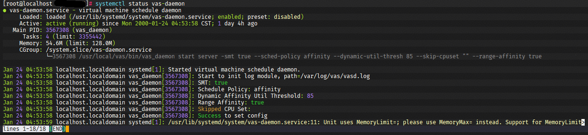

# 部署指导

---

## 系统要求

- 操作系统：openEuler 24.03 LTS SP2
- CPU架构：aarch64
- 用户权限：安装与管理需 `root` 权限

---

## 软件要求

- libsecurec: 1.1.1
- qemu: 8.2.0
- libvirt: 9.1.0

---

## 拷贝软件包到部署环境

使用文件传输软件, 将`virt-awaresched-*.*.*-1.aarch64.rpm`软件包上传至服务器。

---

## 安装rpm包

- 首次安装

    ```shell
    rpm -ivh virt-awaresched-*.rpm
    ```

- 覆盖安装

    ```shell
    rpm -ivh --force virt-awaresched-*.rpm
    ```

---

## 确认服务部署状态

```shell
systemctl status vas-daemon
```

出现如下返回信息，说明服务已正常启动。



如果服务启动失败, 请查看服务日志(默认路径: `/var/log/vas/vas.log`), 确认启动失败原因.

---

## 修改启动参数

- 详细请参考[配置说明](../config/CONFIG.md)
- 重新加载配置

    ```shell
    systemctl daemon-reload
    ```

- 重启服务

    ```shell
    systemctl restart vas-daemon
    ```

---

## 动态绑核模式环境准备

- 配置grub.cfg
  1. 打开/boot/efi/openEuler/grub.cfg文件
    ```shell
    vi /boot/efi/openEuler/grub.cfg
    ```
  2. 按“i”进入编辑模式，在当前系统对应的启动子项末尾添加`dynamic_affinity=enable`。 当前系统的启动子项可通过执行`cat /proc/cmdline` 命令确认，此处以6.6.0-98.0.0.103.oe2403sp2.aarch64为例
    ```shell
    linux /vmlinuz-6.6.0-98.0.0.103.oe2403sp2.aarch64 root=/dev/mapper/openeuler-root ...... console=tty0 dynamic_affinity-enable
    ```
  3. 按“Esc”键，输入“:wq!”，按“Enter”保存并推出编辑。重启操作系统后明明行参数配置生效。

- 选核范围决策<br>
  DA_UTIL_TASKGROUP开关控制动态亲和CPU利用率阈值策略，默认开启。配置说明如表格所示。

| 配置项 | 执行命令                                                        | 说明                                                                                                            |
|:----|:------------------------------------------------------------|:--------------------------------------------------------------------------------------------------------------|
| 开启  | echo DA_UTIL_TASKGROUP > /sys/kernel/debug/sched/feature    | 默认值为开启。<br>开启状态下，通过检测任务组(taskgroup)在preferred_cpus中的利用率进行选核范围决策。                                              |
| 关闭  | echo NO_DA_UTIL_TASKGROUP > /sys/kernel/debug/sched/feature | 不适用组调度时建议关闭<br>关闭状态下，通过检测preferred_cpus的总利用率(即包括非taskgroup进程在preferred_cpus的使用量)进行选核范围决策。 |
