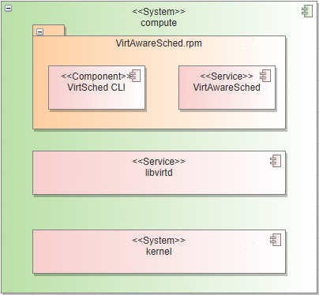
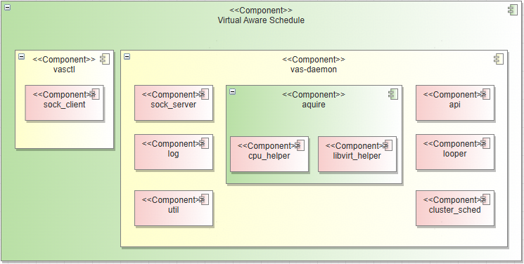
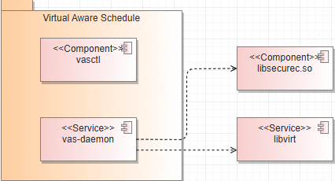
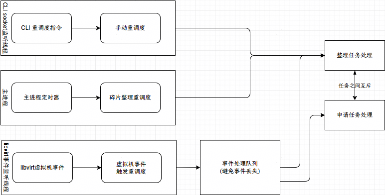
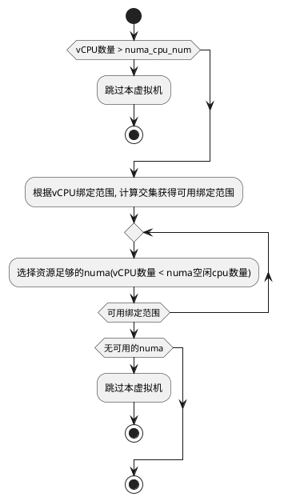
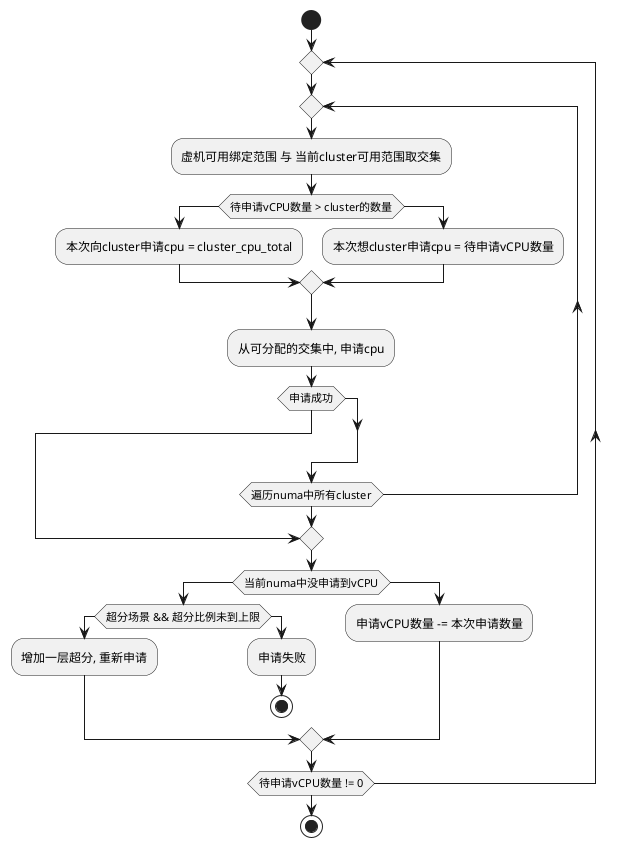
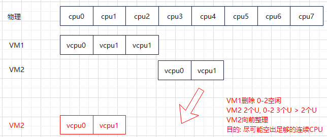
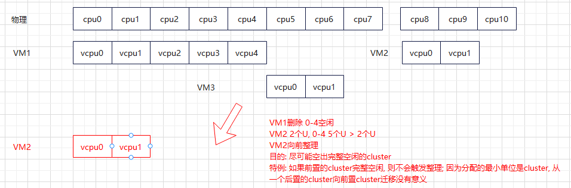
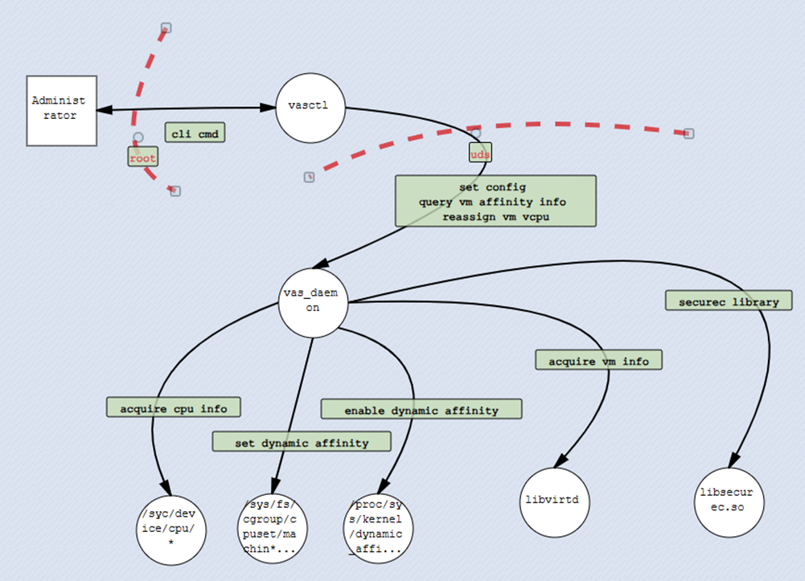
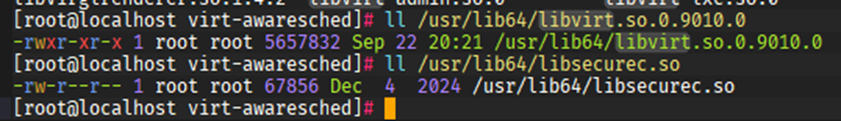

# 架构设计

## 📌软件定位


---

## 部署视图



---

## 软件模块



---

## 外部依赖



---

## 关键业务

**关键业务流程: 采集并调度CPU资源, 实现虚机vCPU绑核使用**



### 调度与整理设计思路

#### 调度

原则:

1. 无法调优的虚拟机不做管理
2. vCPU不支持跨numa CPU绑定

- 初步筛选


- 申请

vCPU数量超过cluster_cpu_total: 即一定会跨cluster, 则要求尽可能分配完整空闲的cluster, 否则放弃调优
`exp: vCPU = 12; cluster_cpu_total = 8; 只有一种调优结果, 8 + 4; 分两个cluster调优`
vCPU数量不超过cluster_cpu_total: 即一定不会跨cluster, 则只能接收分配在一个cluster内, 否则放弃调优
`exp: vCPU = 6; cluster_cpu_total = 8; 只有一种调优结果, 一个cluster中分配6个`



#### 整理

整理依旧需要满足调整的目标cpu在虚机可绑定的范围中

- 1.cluster内整理



- 2.cluster间整理



#### 重调度

即释放申请的资源, 再重新调度
`exp: VM1 0; VM2 1-2; 当VM1虚拟机删除后, 在整理流程中, 不会进行调整. 可以通过reassign, 手动释放再申请. 结果为 VM2 0-1`

---

## 👍可靠性设计

| 可靠性场景类型   | 服务              | 分析项                        | 影响特性    | 影响分析                            | 可靠性保障策略                          |
|:----------|:----------------|:---------------------------|:--------|:--------------------------------|:---------------------------------|
| 外部接口可靠性重试 | virtAwarehSched | 线性调度服务提供socket中断           | CLI工具接口 | CLI工具使用短链接, socket断链, CLI指令执行失败 | CLI使用短链接, 失败由上层业务重试业务即可          |
| 自身服务中断后恢复 | virtAwarehSched | 下发CLI指令重调度后, 服务中断重启        | CLI工具接口 | 业务中断,导致内存中调度队列被清空.丢失本次重调度任务     | 调度任务丢失无需回复, CLI指令失败. 重试指令重新调度即可  |
| 自身服务中断后恢复 | virtAwarehSched | 定时器触发CPU碎片整理, 服务中断重启       | 自感知调度   | 业务中断,导致内存中调度队列被清空.丢失本次重调度任务     | 定时任务, 重启后立即执行一次全量调度即可            |
| 自身服务中断后恢复 | virtAwarehSched | 接收到libvirt虚拟机生命事件后, 服务中断重启 | 自感知调度   | 业务中断,导致内存中调度队列被清空.丢失本次重调度任务     | 虚拟机生命周期异步触发的事件, 重启后立即执行一次全量调度即可  |
| 自身服务中断后恢复 | virtAwarehSched | 服务中断重启                     | 自感知调度   | 业务中断,导致调度结果丢失                   | 调度任务丢失无需回复. 等待服务启动后, 会对虚拟机进行重新调度 |
| 预期内业务失败   | vasctl          | CLI指令执行失败                  | CLI工具接口 | CLI指令执行失败, 功能执行失败               | CLI接口需要支持幂等调用                    |

---

## 🛡安全性设计

### 安全设计目标

- 权限最小化
- 暴露面安全

### 威胁分析



### 目录/文件 权限设计

| 元素                            | 类型     | owner     | 权限  | 其它说明              |
|:------------------------------|:-------|:----------|:----|:------------------|
| /usr/local/vas                | 目录     | root:root | 550 | 服务主目录             |
| /usr/local/vas/bin            | 目录     | root:root | 500 | 服务可执行文件目录         |
| /usr/local/vas/bin/vas_daemon | 可执行文件  | root:root | 500 | daemon服务可执行文件     |
| /usr/local/bin/vasctl         | 可执行文件  | root:root | 500 | vas cli指令可执行文件    |
| /var/log/vas                  | 目录     | root:root | 750 | 日志目录              |
| /var/log/vas/vasd.log         | 日志文件   | root:root | 640 | 日志文件              |
| /var/log/vas/vasd.log.1       | 归档日志文件 | root:root | 440 | 归档日志文件            |
| /var/run/vas                  | 目录     | root:root | 700 | 运行时目录             |
| /var/run/vas/vas_uds.sock     | uds文件  | root:root | 600 | ctl与daemon服务通信uds |

### 暴露面设计

- 基于UDS的对外接口安全设计
- vas-daemon启动参数安全设计 (详见接口设计)
- vas-cli指令参数安全设计 (详见接口设计)
- 环境变量
- 依赖动态库

#### 基于UDS的对外接口安全设计

uds对外接口的访问入口/var/run/vas/vas_uds.sock. sock文件的安全访问, 基于文件权限控制, 其属主为root,  mod为600, 如下:

```shell
srw-------  root root /var/run/vas/vas_uds.sock
```

#### 环境变量

未指定特殊环境变量, 环境变量继承于root用户环境变量. 详见[vas-daemon.service](../../vas-daemon.service)

#### 依赖动态库

依赖动态库包括libvirt.so, libsecurec.so. 依赖所有库均以root权限安装. 不存在引用低权限动态库导致的攻击行为.



---