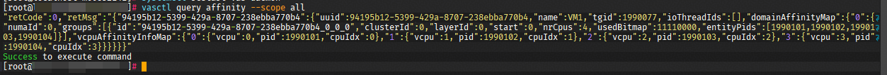
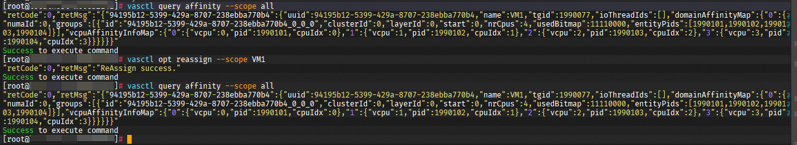
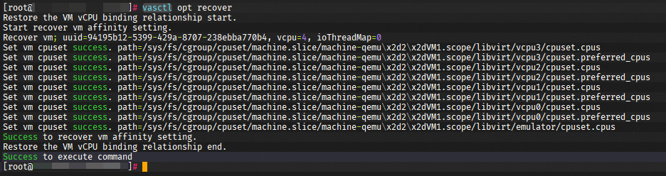

# 典型使用场景

> 下文中, 使用到的CLI指令, 可以参考[CLI 指令参考](../cli/cli_docs_reference.md)

---

## 自动调优

1. 参考[部署文档](../build_install), 服务启动后, 会进行自动调优. 
2. 通过`vasctl query affinity --scope all`指令, 查询调度结果



---

## 手动调度

如果对当前自动调度结果不满意, 可以尝试使用指令, 手动重调度指定的虚拟机. 

```shell
vasctl opt reassign --scope VM1
```



---

## 恢复

一般情况下, 服务正常退出时, 会回滚所有调优操作. 当服务异常退出, 无法正确恢复调优操作时, 可以使用指令, 手动恢复


