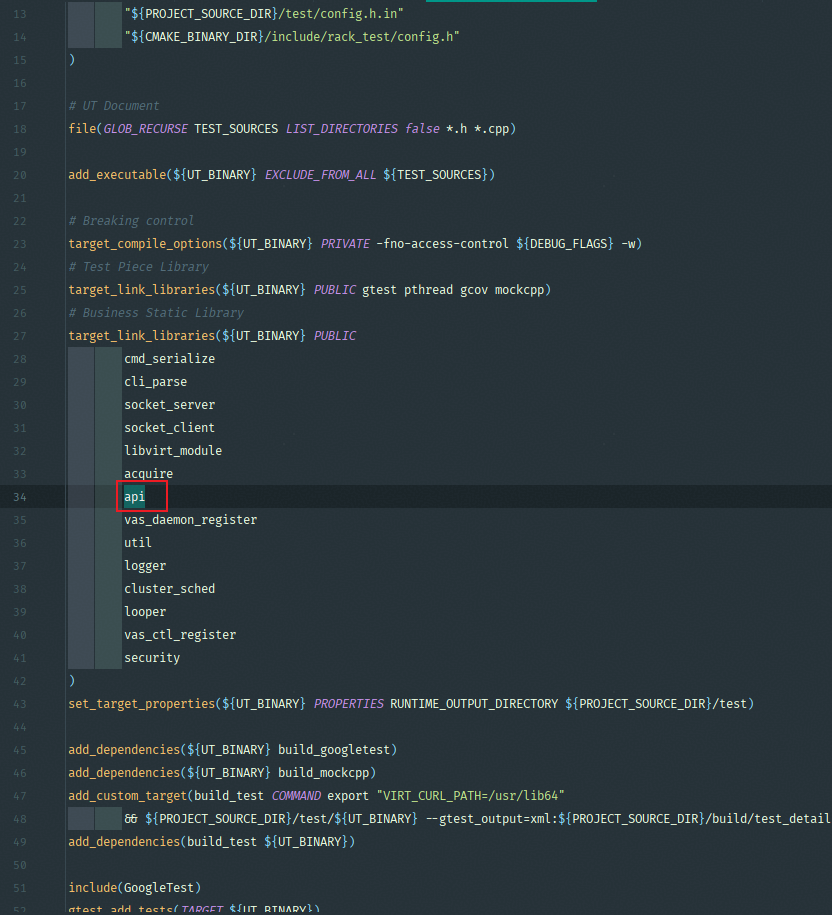

# 单元测试开发指南

> 本指南旨在帮助开发者为 `virt-awaresched` 项目编写高质量的 C++ 单元测试（Unit Test, UT）。我们将介绍整体测试框架、环境搭建、用例编写规范以及运行与覆盖率分析方法，确保代码质量可控、可维护。

---

## 测试框架说明

我们采用 **Google Test (GTest)** 作为核心单元测试框架，并结合 **MockCpp** 实现对外部依赖的行为模拟，以支持复杂模块的隔离测试。

### 技术栈

**表 1** 工具用途说明

| 工具                                                 | 用途                          |
|----------------------------------------------------|-----------------------------|
| [GoogleTest](https://google.github.io/googletest/) | C++ 单元测试框架，提供断言、测试套件管理等功能。|
| [MockCpp](https://github.com/sinojelly/mockcpp)    | 轻量级 C++ Mock 框架，用于接口打桩与行为验证。|
| CMake                                              | 构建系统，自动化编译与链接测试目标。|
| Bash Script                                        | 封装构建脚本 (`build.sh`)，简化操作流程。|

### 编译构建

单元测试使用cmake进行构建和管理，详细内容在`test`目录下可以进行查看。

---

## 环境准备

1. 开发环境搭建参考《构建指导》。

2. 推荐在`openEuler Linux (ARM64)`下执行项目构建，进入vir-awaresched所在目录。

3. 执行以下命令：

    ```shell
    bash build.sh 3rdparty
    bash build.sh ut
    ```

---

## 增加单元测试用例

### 场景一：向已有测试文件补充用例

> **背景设定**
>
> 开发者想针对当前的业务代码 `src/vasd/cluster_sched/cluster_sched.cpp`中的`UpdateDomainInfo` 函数添加测试用例，当前在`test/vasd/cluster_sched/test_cluster_sched.cpp`已经存在部分用例。

#### 新增测试代码

在`test/vasd/cluster_sched/test_cluster_sched.cpp`中新增如下代码：

```cpp
TEST_F(TestClusterSched, testUpdateDomainInfo1)
    {
        MOCKER_CPP(&LibvirtHelper::GetVmInfoList, VasRet(LibvirtHelper::*)(VmInfoMap &))
            .stubs()
            .will(invoke(GetVmInfoListMockSuccess));
        MOCKER(&ClusterSched::SelectVmNuma).stubs().will(returnValue(VAS_OK));
        MOCKER(&ClusterSched::Alloc).stubs().will(returnValue(VAS_ERROR)).then(returnValue(VAS_OK));
        MOCKER(&ClusterSched::Assign).stubs().will(returnValue(VAS_ERROR)).then(returnValue(VAS_OK));
        std::string domainKey = uuid01 + "_0";
        EXPECT_EQ(ClusterSched::GetInstance().UpdateDomainInfosAndSched(), VAS_OK);
        EXPECT_FALSE(ClusterSched::GetInstance().domainMap_[domainKey].isReScheded);
        EXPECT_EQ(ClusterSched::GetInstance().UpdateDomainInfosAndSched(), VAS_OK);
        EXPECT_FALSE(ClusterSched::GetInstance().domainMap_[domainKey].isReScheded);
        EXPECT_EQ(ClusterSched::GetInstance().UpdateDomainInfosAndSched(), VAS_OK);
        EXPECT_TRUE(ClusterSched::GetInstance().domainMap_[domainKey].isReScheded);
    }
```

#### 验证用例

在`virt-aware`目录下对用例进行用例验证。

执行以下命令：

```bash
bash build.sh ut -- --gtest_filter="TestClusterSched.testUpdateDomainInfo1"
```

其中，`TestClusterSched`为**`TestSuite`**名，`testUpdateDomainInfo1`为**`TestName`**。

### 场景二：为新业务模块创建全新单元测试

> **背景设定**
>
> 开发者在当前项目基础上，增加了新的业务功能，希望对新的业务代码编写对应的单元测试。以本项目的`api`模块为例，开发者完成了`api`模块，代码位于`src/vasd/api`，目前需要进行单元测试。

#### 查找模块名

查看`src/vasd/api`下日志模块的`CMakeLists`库名为`api`。

#### 增加模块UT目录

在 `test/vasd`目录下新建 `api`目录，并创建`CMakeLists.txt`文件，在`CMakeLists.txt`文件中加入如下内容：

```cmake
add_ut(ubse_log)
```

在 `test`目录下`CMakeLists.txt`文件中添加如下内容：



#### 开发UT代码

在`test/api`目录下新建测试文件`test_api.h`和`test_api.cpp`，完成对具体的业务代码的测试，在`TestApi`测试套中写了一个测试用例. 详细测试代码, 请参考[test/vasd/api/](../../test/vasd/api)。

#### 运行模块的UT代码

在virt-awaresched目录下, 运行`bash build.sh ut -- --gtest_filter="TestApi.*"`查看用例运行情况。
