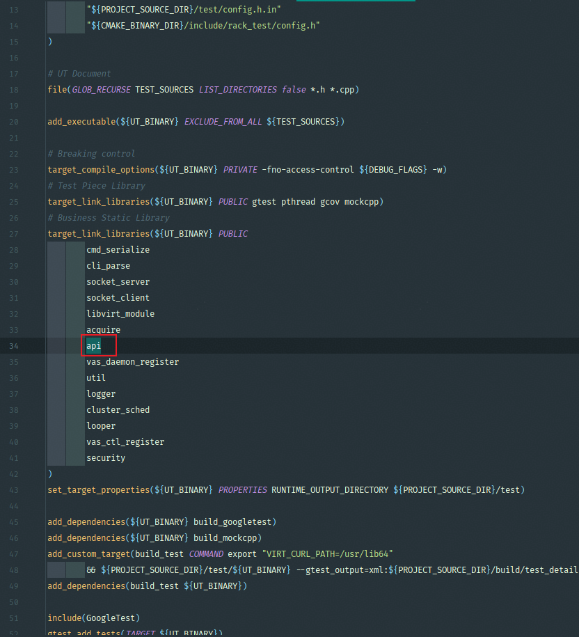

# 单元测试开发指南

> 本指南旨在帮助开发者为 `virt-awaresched` 项目编写高质量的 C++ 单元测试（Unit Test, UT）。我们将介绍整体测试框架、环境搭建、用例编写规范以及运行与覆盖率分析方法，确保代码质量可控、可维护。

---

## 测试框架说明

我们采用 **Google Test (GTest)** 作为核心单元测试框架，并结合 **MockCpp** 实现对外部依赖的行为模拟，以支持复杂模块的隔离测试。

### 技术栈

**表 1** 工具用途说明

| 工具                                                 | 用途                          |
|----------------------------------------------------|-----------------------------|
| [GoogleTest](https://google.github.io/googletest/) | C++ 单元测试框架，提供断言、测试套件管理等功能。|
| [MockCpp](https://github.com/sinojelly/mockcpp)    | 轻量级 C++ Mock 框架，用于接口打桩与行为验证。|
| CMake                                              | 构建系统，自动化编译与链接测试目标。|
| Bash Script                                        | 封装构建脚本 (`build.sh`)，简化操作流程。|

### 编译构建

单元测试使用cmake进行构建和管理，详细内容在`test`目录下可以进行查看。

---

## 环境准备

单元测试支持以下两种运行方式：

* 方式一：在物理机中直接运行 UT
* 方式二：在预编译容器中运行 UT

### 方式一：在物理机中运行 UT

1. 开发环境搭建参考《构建指导》。

2. 推荐在`openEuler Linux (ARM64)`下执行项目构建，进入virt-awaresched所在目录。

3. 执行以下命令：

    ```shell
    bash build.sh test
    ```

### 方式二：在预编译容器中运行 UT

#### 使用限制

预编译镜像中已经安装 `virt-awaresched` 编译构建和 UT 所需的构建工具及系统依赖。构建和 UT 使用同一个 `oe2403-v1` 容器即可完成。

源码编译和 UT 不需要将宿主机的 `/lib/modules` 等目录挂载到容器，也不需要授予容器额外的内核权限。

首次构建 UT 时，构建系统会下载 GoogleTest、MockCpp 及 MockCpp ARM64 补丁，需确保容器可以访问 `cmake/gtest.cmake` 和 `cmake/mockcpp.cmake` 中配置的下载地址。

#### 拉取镜像并启动容器

该镜像允许匿名拉取，执行：

```shell
docker pull swr.cn-north-4.myhuaweicloud.com/ubscore/ubs-virt:oe2403-v1
```

> 若返回 `denied` 或 `unauthorized`，请向镜像仓库管理员申请读取权限后重试。

启动容器：

```shell
docker run -it \
    --name=ubs-virt \
    swr.cn-north-4.myhuaweicloud.com/ubscore/ubs-virt:oe2403-v1 \
    /bin/bash
```

#### 在容器中运行 UT

进入容器后，拉取源码并执行：

```shell
git clone -b openEuler-24.03-LTS-SP3 \
    https://gitcode.com/openeuler/ubs-virt.git \
    /home/ubs-virt-src
cd /home/ubs-virt-src/virt-awaresched
bash build.sh test
```

`bash build.sh test` 会在该容器中完成 UT 的构建并运行全部用例，无需额外执行依赖安装步骤，也无需为 UT 另行创建容器。

#### 结果判断

脚本退出码为`0`，且日志汇总输出`PASSED`（无`FAILED`用例），表示UT全部通过，示例如下：

```text
[==========] 184 tests from 18 test suites ran.
[  PASSED  ] 184 tests.
```

若运行指定用例，可通过`--gtest_filter`过滤，用法见下文"增加单元测试用例"。

---

## 增加单元测试用例

### 场景一：向已有测试文件补充用例

> **背景设定**
>
> 开发者想针对当前的业务代码 `src/vasd/cluster_sched/cluster_sched.cpp`中的`UpdateDomainInfo` 函数添加测试用例，当前在`test/vasd/cluster_sched/test_cluster_sched.cpp`已经存在部分用例。

#### 新增测试代码

在`test/vasd/cluster_sched/test_cluster_sched.cpp`中新增如下代码：

```cpp
TEST_F(TestClusterSched, testUpdateDomainInfo1)
    {
        MOCKER_CPP(&LibvirtHelper::GetVmInfoList, VasRet(LibvirtHelper::*)(VmInfoMap &))
            .stubs()
            .will(invoke(GetVmInfoListMockSuccess));
        MOCKER(&ClusterSched::SelectVmNuma).stubs().will(returnValue(VAS_OK));
        MOCKER(&ClusterSched::Alloc).stubs().will(returnValue(VAS_ERROR)).then(returnValue(VAS_OK));
        MOCKER(&ClusterSched::Assign).stubs().will(returnValue(VAS_ERROR)).then(returnValue(VAS_OK));
        std::string domainKey = uuid01 + "_0";
        EXPECT_EQ(ClusterSched::GetInstance().UpdateDomainInfosAndSched(), VAS_OK);
        EXPECT_FALSE(ClusterSched::GetInstance().domainMap_[domainKey].isReScheded);
        EXPECT_EQ(ClusterSched::GetInstance().UpdateDomainInfosAndSched(), VAS_OK);
        EXPECT_FALSE(ClusterSched::GetInstance().domainMap_[domainKey].isReScheded);
        EXPECT_EQ(ClusterSched::GetInstance().UpdateDomainInfosAndSched(), VAS_OK);
        EXPECT_TRUE(ClusterSched::GetInstance().domainMap_[domainKey].isReScheded);
    }
```

#### 验证用例

在`virt-aware`目录下对用例进行用例验证。

执行以下命令：

```bash
bash build.sh test -- --gtest_filter="TestClusterSched.testUpdateDomainInfo1"
```

其中，`TestClusterSched`为**`TestSuite`**名，`testUpdateDomainInfo1`为**`TestName`**。

### 场景二：为新业务模块创建全新单元测试

> **背景设定**
>
> 开发者在当前项目基础上，增加了新的业务功能，希望对新的业务代码编写对应的单元测试。以本项目的`api`模块为例，开发者完成了`api`模块，代码位于`src/vasd/api`，目前需要进行单元测试。

#### 查找模块名

查看`src/vasd/api`下日志模块的`CMakeLists`库名为`api`。

#### 增加模块UT目录

在 `test/vasd`目录下新建 `api`目录，并创建`CMakeLists.txt`文件，在`CMakeLists.txt`文件中加入如下内容：

```cmake
add_ut(ubse_log)
```

在 `test`目录下`CMakeLists.txt`文件中添加如下内容：



#### 开发UT代码

在`test/api`目录下新建测试文件`test_api.h`和`test_api.cpp`，完成对具体的业务代码的测试，在`TestApi`测试套中写了一个测试用例. 详细测试代码, 请参考[test/vasd/api/](../../test/vasd/api)。

#### 运行模块的UT代码

在virt-awaresched目录下, 运行`bash build.sh test -- --gtest_filter="TestApi.*"`查看用例运行情况。
