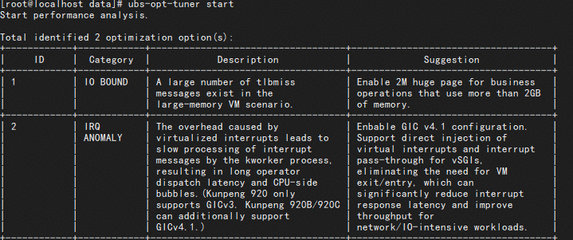

# 概述

## 启动optimizer优化器

```bash
ubs-opt-tuner start
```

> 说明
>
> 将虚拟机性能数据拷贝到物理机对应路径后，执行该命令，ubs-optimizer会给出可配置优化项表格。

## 示例

将采集完成的虚拟机性能数据，从虚拟机拷贝到物理机时，执行以下操作获取可优化项：

```bash
ubs-opt-tuner start
```

回显的可配置优化项表格如下：


