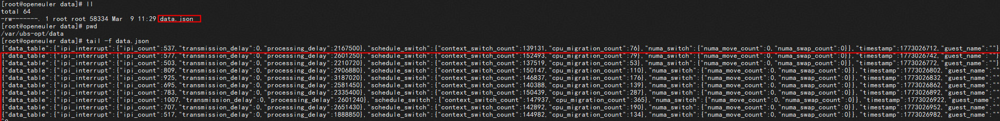

# 概述

## 启动optimizer采集的服务

```bash
ubs-opt start_ebpf
```

> 说明
>
> 执行该命令后，ubs-optimizer会根据配置项，周期性采集虚拟机的性能数据，输出到`/var/ubs-opt/data/data.json`

## 停止optimizer的服务

```bash
ubs-opt stop_ebpf
```

> 说明
>
> 执行该命令后，ubs-optimizer将停止采集虚拟机性能数据。
说明：

## 示例

1. 虚拟机内安装ubs-optimizer的组件完成后，执行以下命令启动ubs-optimizer服务。

    ```bash
    ubs-opt start_ebpf
    ```

2. 查看/var/ubs-opt/data/data.json：


3. 采集完成后，执行以下命令停止ubs-optimizer服务。

    ```bash
    ubs-opt stop_ebpf
    ```
