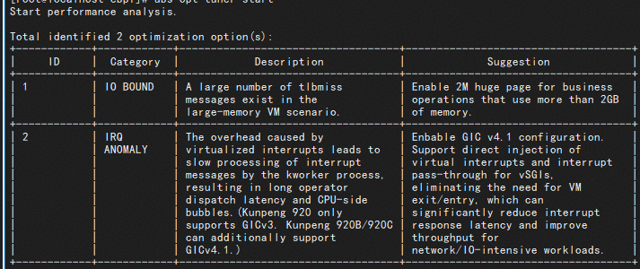
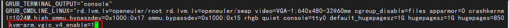

# 如何使用UBS-optimizer

## 介绍

`ubs-optimizer`是基于C++语言开发的，在昇腾虚拟化场景下针对虚拟机性能优化的调优工具。

本章内容旨在帮助开发者快速掌握ubs-optimizer的核心功能以及适用场景，提供可直接运行的代码，并规避常见问题。

## 前置条件

1. 使用ubs-optimizer服务及功能前需确定环境为虚拟化智算场景且满足ubs-optimizer环境要求：
  
    - 判断是否为虚拟机智算场景，具体可参考[性能优化方法](../optimize_operations/性能优化方法.md)中的应用场景。
    - 判断是否为满足ubs-optimizer环境要求，具体可参考[部署说明](../build_install/部署说明.md)中的应用场景。

2. 使用ubs-optimizer服务及功能前需完成ubs-optimizer的环境准备与安装准备, 参考[部署说明](../build_install/部署说明.md)中的软件安装。

## ubs-optimizer 业务部署与启动

1. 获取ubs-optimizer最新的rpm包，并安装到系统。

    - ARM架构操作系统
      
      ```bash
      rpm -ivh ubs-optimizer-0.1.0-k5.1-aarch64.rpm
      ```

    - x86架构操作系统

      ```bash
      rpm -ivh ubs-optimizer-0.1.0-k5.1-x86_64.rpm
      ```

    预期输出示例如下：

    ```shell
    [root@localhost ljj]# rpm -ivh ubs-optimizer-0.1.0-k5.1-aarch64.rpm
    Verifying...                          ################################# [100%]
    Preparing...                          ################################# [100%]
    Checking BPF configs...
    CONFIG_BPF enabled (CONFIG_BPF=y)
    CONFIG_BPF_SYSCALL enabled (CONFIG_BPF_SYSCALL=y)
    CONFIG_BPF_EVENTS enabled (CONFIG_BPF_EVENTS=y)
    CONFIG_BPF_JIT enabled (CONFIG_BPF_JIT=y)
    Your kernel is ready.
    Checking vsock config...
    OK
    Updating / installing...
      1:ubs-optimizer-0.1.0-k5.1         ################################# [100%]
    ```

## 配置调优工具配置项

1. 配置config.json文件。

   a. 编辑"/use/local/sbin/ubs-optimizer/config.json"文件。
    
      ```bash
      vi /usr/local/sbin/ubs-optimizer/config.json
      ```
  
   b. 修改内容示例如下，eBPF指标采集配置参数说明如[配置参数说明](#table1)所示。

        ```json
        {
          "sampling_interval": 30,
          "bind_port": 10101,
          "vm_name": "openeuler",
          "npu_type": "d802",
          "system" : {
              "ipi_collection": "enable",
              "sched_collector": "enable",
              "numa_collector": "enable"
          }
        }
        ```

      **表 1** 参数说明<a id="table1"></a>

      | 参数名 | 取值 | 说明 | 备注 |
      |------|------|------|------|
      | sampling_interval | 取值范围：[1,600]<br>默认：30<br>单位：s | 采集周期 | 需为整数 |
      | bind_port | 取值范围：[1024,49151]<br>默认：10101 | 服务侦听端口 | - |
      | vm_name | 默认：openeuler | 虚拟机实例名称 | - |
      | npu_type | 取值：{d802, d803} | NPU设备标识符 | A2 使用 d802<br>A3 使用 d803 |
      | system-ipi_collector | 取值：{enable, disable}<br>默认：enable | 启用处理器间中断（IPI）监控 | enable：启用<br>disable：关闭 |
      | system-sched_collector | 取值：{enable, disable}<br>默认：enable | 启用进程调度器分析 | enable：启用<br>disable：关闭 |
      | system-numa_collector | 取值：{enable, disable}<br>默认：enable | 启用 NUMA 内存访问监控 | enable：启用<br>disable：关闭 |

      > 说明
      >
      > - 尽可能将表 eBPF指标采集配置说明中的{system-ipi_collector，system-sched_collector，system-numa_collector}全部启用，错误的数据会导致调优项判断异常。
      > - 虚拟机和物理机的正常通信要求配置免密和主机名解析。
      
   c. 保存配置文件。

2. 进入虚拟机，启动eBPF采集进程。

    ```bash
    ubs-opt start_ebpf
    ```

3. 采集一段时间后，在虚拟机里停止eBPF采集进程。

    ```bash
    ubs-opt stop_ebpf
    ```

4. 采集结束后，将虚拟机中采集的数据“/var/ubs-opt/data/data.json”拷贝至物理机“/var/ubs-opt/data/”路径下。性能数据示例如下图所示：

    

5. 在host上启动性能优化器。

    ```bash
    ubs-opt-tuner start
    ```

UBS Optimizer会对虚拟机的性能数据进行分析，并列出可执行的优化项，用户可选择需要的优化项，参考[性能优化方法](../optimize_operations/性能优化方法.md)，手动配置优化。

## 示例

示例的部署及使用场景为：昇腾NPU+鲲鹏CPU的协同计算架构场景，执行以下操作进行性能调优。

1. 虚拟机和物理机部署ubs-optimizer，完成配置文件配置。
2. 虚拟机性能数据采集，并拷贝数据至物理机“/var/ubs-opt/data/”路径。
3. 启动调优器进程。

    ```bash
    ubs-opt-tuner start
    ```

    ubs-optimizer分析虚拟机的性能数据后，会给出优化建议。如下图所示：

    

4. 根据当前应用场景在[性能优化方法](../optimize_operations/性能优化方法.md)中，找到对应的优化描述。

      [性能优化方法](../optimize_operations/性能优化方法.md)中，对应的优化项为GICv4.1以及HugePage 2M优化。

5. 评估后，选择配置GICv4.1优化项，并手动配置GICv4.1优化项，配置操作如下：

    a.修改宿主机的/etc/default/grub，在GRUB_CMDLINE_LINUX项的末尾加入以下参数：

      ```shell
      kvm-arm.vgic_v4_enable=1
      ```

      

    b.修改完成后，查看宿主机启动方式，执行对应命令，重新生成`GRUB2`的启动配置文件，并重启操作系统。

      

    c.重启宿主机后，执行以下命令，存在回显，则说明配置成功。

      ```bash
      cat /proc/cmdline | grep vgic_v4_enable
      ```
