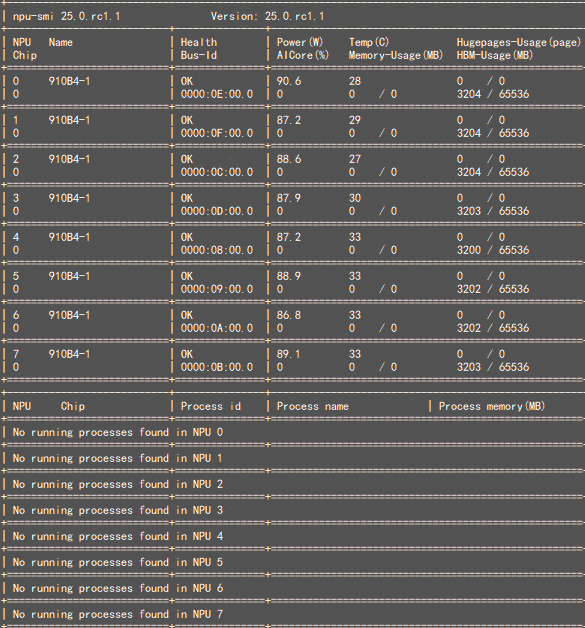
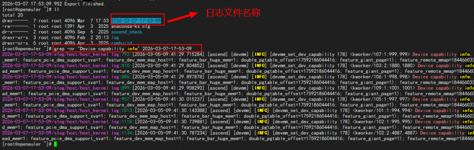
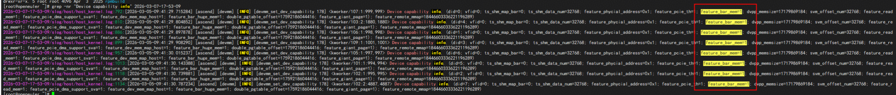
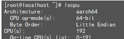
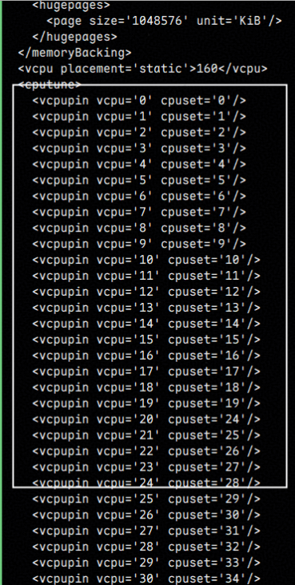
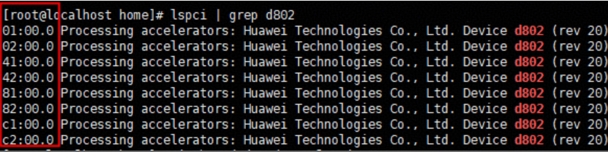
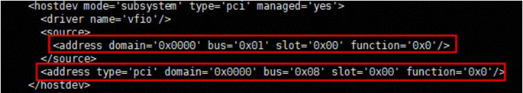
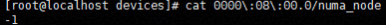
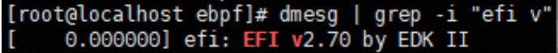
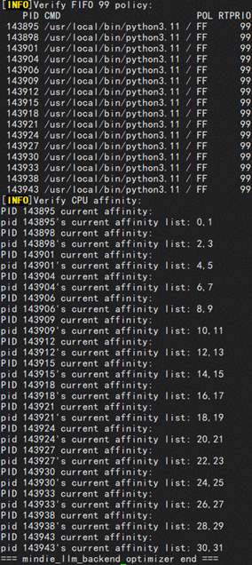

# 一、应用场景：
当前ubs-optimizer支持以下两种场景：
### 场景1：昇腾NPU+鲲鹏CPU的协同计算架构场景
该场景有如下限制：
1. 架构：ARM架构，鲲鹏型号CPU，昇腾型号NPU
2. 操作系统：openEuler 22.03 LTS SP4
3. NPU驱动：Ascend HDK 24.1.1及以上
4. 软件版本：使用Libvirt v9.4及以上，QEMU v8.1及以上
5. 硬件：
- Atlas 900 A3 SuperPoD 超节点A900；
- A3 SuperPoD 超节点；
- Atlas 800T A2 训练服务器；
- A800T A2 训练服务器
### 场景2：昇腾NPU+X86架构CPU的协同计算架构场景
该场景有如下限制：
1. 架构：X86架构，昇腾型号NPU33
2. 操作系统：TencentOS Server 3.1
3. NPU驱动：Ascend HDK 25.3.RC1及以上
4. 软件版本：使用Libvirt v9.4及以上，QEMU v8.1及以上
5. 硬件：G8600服务器

# 二、优化方法：
### 场景1：昇腾NPU+鲲鹏CPU的协同计算架构场景
##### （1）WriteCombine优化
- 原理介绍
```
 
WC（Write Combining，写合并）是一种提升主机向非缓存PCIe设备写入性能的技术。写入WC区域的数据会暂存于64字节缓冲区，待缓冲区填满或触发刷新事件（如写入地址超出当前缓冲区范围）时，执行合并写入，显著提升总线利用率，实现更高吞吐量。该特性在当前约束限制下的物理机上默认开启，本章节主要指导用户如何开启虚拟机内的WC特性，用户需要修改物理机内核代码、QEMU代码后重新编译安装。
```
- 配置方法
  
步骤1 虚拟机内验证write combing是否开启
确保虚拟机内安装了NPU Driver驱动，可以通过npu-smi info查询到所有NPU信息后，执行如下命令。

```
npu-smi info
```



执行以下命令会在当前执行目录下生成例如"yyyy-MM-dd-HH-mm-ss"的日志目录。
```
msnpureport
```


```
grep -nr "Device capability info" <日志目录名称>
```



发现“feature_bar_mem=1”内容，即表示write combing已开启。



步骤2 若write combing已开启，则环境上的qemu不需要打patch；
步骤3 若write combing未开启，参考以下链接，修改内核以及QEMU代码实现该优化：
https://www.hiascend.com/document/detail/zh/Atlas%20200I%20A2/2550/re/virtualmachineconfiguration/topic_0000002482818233.html

##### （2）cpu绑核优化
- 原理介绍
```
CPU一对一绑核能换来vCPU稳定、低延迟和更高缓存命中率，降低调度开销，提高虚拟机的性能;CPU绑核会牺牲物理机CPU的弹性和利用率，需要用户自行权衡资源利用率和虚拟机的性能。
```
- 配置方法
  步骤1 进入虚机执行命令，打开并修改虚机的XML定义文件

```
virsh edit <vm_name>
# 此处<vm_name>为用户虚拟机名称
```
步骤2 手动让每一个cpuset（物理CPU）唯一对应一个vCPU（虚拟CPU）
**示例**：
物理机上CPU编号有0-191



虚拟机XML中配置<cputune>，配置192个<vcpupin>,其中cpuset依次为0-191，vCPU依次为0-191，cpuset与vcpu一一对应



步骤3 保存xml修改并重启虚拟机

```
virsh reboot openeuler
```

##### （3）NUMA NPU亲和绑定
- 原理介绍

物理机上NPU与NUMA之间存在亲和关系，令NPU优先使用同一个NUMA节点内的CPU；将该特性在虚拟机内使能，与物理机保持一致，不影响正常业务场景
- 配置方法

步骤1 获取物理机上NPU的PCI号

```
lspci | grep d802 
# 其中A2为d802，A3为d803
```
**示例**



步骤2 在XML中查询物理机的PCI和虚拟机的PCI对应关系
执行以下命令，通过source内address中的bus来找到该NPU对应的虚拟机映射PCI，因为该bus是和步骤1的PCI号一一对应，比如第一个NPU的PCI号是01:00.0，这里bus就是0x01,<Device>.<Function>是00.0

```
virsh edit <vm_name>
# 此处<vm_name>为用户虚拟机名称
```
**示例**



步骤3 查看物理机NPU的NUMA号

```
cd /sys/bus/pci/devices
cat <domain>\:<Bus>\:<Device>.<Function>/numa_node
```
其中
```
<domain>\:<Bus>\:<Slot>.<Function>
```
是根据lspci得到的PCI号
**示例**

```
01:00.0 Processing accelerators: Huawei Technologies Co., Ltd. Device d802 (rev 20)
```
此处01:00.0设备，domain为0000，Bus为01，Slot.Function为00.0;
查看其NUMA号：

```
cat /sys/bus/pci/devices/0000\:02\:00.0/numa_node
```


该设备在物理机上绑定的numa为0


步骤4 进入到虚拟机中/sys/bus/pci/devices目录下，查看该NPU在虚拟机上的绑定的NUMA，返回信息-1，即表示现在还没有绑定

```
cd /sys/bus/pci/devices
cat <domain>\:<Bus>\:<Device>.<Function>/numa_node
```
示例


虚拟机xml中hostdev字段中，直通的NPU设备PCI地址中，domain为0000，Bus为08，Slot.Function为00.0
查看其NPU设备绑定numa

```
cd /sys/bus/pci/devices
cat 0000\:08\:00.0/numa_node
```



步骤5 为虚机上没绑定NUMA的NPU，绑定相应的NUMA，建议一一对应

```
echo "<numa_num>"> /sys/bus/pci/devices/<domain>\:<Bus>\:<Slot>.<Function>/numa_node
cat <domain>\:<Bus>\:<Slot>.<Function>/numa_node
```
其中

```
<domain>\:<Bus>\:<Slot>.<Function>
```
为虚拟机的NPU设备地址，numa_num为物理机上与虚拟机一一对应的NPU设备,将虚拟机上NPU设备绑定的NUMA配置为与物理机一致；

步骤6 重复以上操作，在虚拟机中，为所有直通虚拟机的NPU绑定NUMA，能够有效减少性能劣化；

##### （4）Halt-Poll
- 原理介绍

```
通过修改虚拟机中guest_halt_poll_allow_shrink、cpuidle_haltpoll和guest_halt_poll_ns配置项，能够减少VM-exit/entry次数，降低唤醒延迟；但物理机上分配给虚拟机的CPU会被占用更多、功耗上升，该优化项每次虚拟机重启失效；
```
- 配置方法
  在虚拟机中执行以下操作：

```
echo Y > /sys/module/cpuidle_haltpoll/parameters/force
echo 2000000000 > /sys/module/haltpoll/parameters/guest_halt_poll_ns
echo N > /sys/module/haltpoll/parameters/guest_halt_poll_allow_shrink
```
查看操作是否生效

```
cat /sys/module/cpuidle_haltpoll/parameters/force
cat /sys/module/haltpoll/parameters/guest_halt_poll_ns
cat /sys/module/haltpoll/parameters/guest_halt_poll_allow_shrink
 
```

##### (5)HugePage 2M优化
- 原理介绍
```
将虚拟机大页设置成2M，减少页表层次和TLB压力，提高内存访问效率;该特性不影响正常业务场景
```
- 配置方法

步骤1 进入虚拟机编辑GRUB文件，配置大页数目
执行以下命令编辑GRUB文件

```
vi /etc/default/grub
```
按“i”进入编辑模式，在GRUB_CMDLINE_LINUX项的末尾加入以下参数

```
default_hugepagesz=2M hugepagesz=2M hugepages=pageNums
```
其中，pageNums为需要自定义所需分配的大页数目。
按“Esc”，输入“:wq！”保存并退出。

步骤2 执行以下命令查询虚拟机启动方式

```
sudo dmesg | grep -i "efi"
```
返回信息示例



若返回信息中显示EFI相关信息，如上图返回信息示例所示即表示UEFI启动，否则为BIOS启动。确定启动方式后，执行以下命令使配置生效。
若为UEFI：

```
grub2-mkconfig -o /boot/efi/EFI/openEuler/grub.cfg
```
若为BIOS：

```
grub2-mkconfig -o /boot/grub2/grub.cfg
```

步骤3 重启虚拟机，重启后执行以下命令检查2M大页是否配置生效。

```
cat /proc/meminfo | grep Hugepagesize
```
步骤4 推理的时候执行以下命令添加环境变量，使能2M大页推理的优化。

```
export GLIBC_TUNABLES=glibc.malloc.hugetlb=2
```

##### （6）QEMU进程隔离
- 原理介绍

```
通过该方式能够让不同的虚拟机进程、关键业务进程运行在不同的物理/逻辑CPU上，防止互相抢占CPU资源。该特性不影响正常业务场景，QEMU进程重启后失效。
 
```
- 配置方法
  执行taskset命令，将指定的QEMU虚拟机进程绑定到特定的CPU上运行。

```
taskset -cp <CPU_ID> <QEMU_ID>
 
```

##### (7)vCPU隔离独占
设置vCPU隔离独占使得虚拟机的CPU不再被物理机任务频繁抢占，减少上下文切换和 VM-exit/entry 开销。vCPU隔离会导致物理机CPU被虚拟机完全独占，降低多虚拟机场景下的CPU复用率，追求极致性能的场景可以开启本特性，谨慎开启。

步骤1 编辑GRUB文件，进行虚机CPU分配配置。
执行以下命令编辑GRUB文件。

```
vi /etc/default/grub
```
按“i”进入编辑模式，在GRUB_CMDLINE_LINUX项的末尾加入以下参数。

```
isolcpus=<分配给虚拟机的cpu>
nohz_full=<分配给虚拟机的cpu> 
rcu_nocbs=<分配给虚拟机的cpu>
```
其中，<分配给虚拟机的cpu>需要根据实际创建的虚拟机规格进行配置。
按“Esc”，输入“:wq！”保存并退出。

步骤2 执行以下命令查询物理机启动方式。

```
sudo dmesg | grep -i "efi"
```
返回信息示例


若返回信息中显示EFI相关信息，如上图返回信息示例所示即表示UEFI启动，否则为BIOS启动。确定启动方式后，执行以下命令使配置生效。
若为UEFI：

```
grub2-mkconfig -o /boot/efi/EFI/openEuler/grub.cfg
```
若为BIOS：

```
grub2-mkconfig -o /boot/grub2/grub.cfg
```

步骤3 重启物理机，重启后执行以下命令检查配置是否生效。

```
cat /proc/cmdline
```

##### （8）GICv4.1
前置条件：

```
该优化项存在一定约束条件，鲲鹏芯片仅920B型号和920C型号可额外支持GICv4.1
```


步骤1 配置GIC Version。
重启物理机，在开机自检时进入BIOS。在路径Advanced > Processor Configuration > GIC Version中将GIC Version设置为4.1。

步骤2 编辑GRUB文件，以使能GICv4.1。
执行以下命令编辑GRUB文件。

```
vi /etc/default/grub
```
按“i”进入编辑模式，在GRUB_CMDLINE_LINUX项的末尾加入以下参数。

```
kvm-arm.vgic_v4_enable=1
```
按“Esc”，输入“:wq！”保存并退出。

步骤3 执行以下命令查询物理机启动方式。

```
sudo dmesg | grep -i "efi"
```
返回信息示例


若返回信息中显示EFI相关信息，如上图返回信息示例所示即表示UEFI启动，否则为BIOS启动。确定启动方式后，执行以下命令使配置生效。
若为UEFI：

```
grub2-mkconfig -o /boot/efi/EFI/openEuler/grub.cfg
```
若为BIOS：

```
grub2-mkconfig -o /boot/grub2/grub.cfg
```

步骤4 重启物理机，重启后执行以下命令检查配置是否生效。

```
cat /proc/cmdline | grep vgic_v4_enable
```

### 场景2：昇腾NPU+鲲鹏CPU的协同计算架构场景
##### （1）WriteCombine优化
- 原理介绍
```
 
WC（Write Combining，写合并）是一种提升主机向非缓存PCIe设备写入性能的技术。写入WC区域的数据会暂存于64字节缓冲区，待缓冲区填满或触发刷新事件（如写入地址超出当前缓冲区范围）时，执行合并写入，显著提升总线利用率，实现更高吞吐量。该特性在当前约束限制下的物理机上默认开启，本章节主要指导用户如何开启虚拟机内的WC特性，用户需要修改物理机内核代码、QEMU代码后重新编译安装。
```
- 配置方法

步骤1 虚拟机内验证write combing是否开启
确保虚拟机内安装了NPU Driver驱动，可以通过npu-smi info查询到所有NPU信息后，执行如下命令。

```
npu-smi info
```


执行以下命令会在当前执行目录下生成例如"yyyy-MM-dd-HH-mm-ss"的日志目录。
```
msnpureport
```

![]


```
grep -nr "Device capability info" <日志目录名称>
```


发现“feature_bar_mem=1”内容，即表示write combing已开启。


步骤2 若write combing已开启，则环境上的qemu不需要打patch；
步骤3 若write combing未开启，参考以下链接，修改内核以及QEMU代码实现该优化：
https://www.hiascend.com/document/detail/zh/Atlas%20200I%20A2/2550/re/virtualmachineconfiguration/topic_0000002482818233.html

##### （2）cpu绑核优化
- 原理介绍
```
CPU一对一绑核能换来vCPU稳定、低延迟和更高缓存命中率，降低调度开销，提高虚拟机的性能;CPU绑核会牺牲物理机CPU的弹性和利用率，需要用户自行权衡资源利用率和虚拟机的性能。
```
- 配置方法
  步骤1 进入虚机执行命令，打开并修改虚机的XML定义文件

```
virsh edit <vm_name>
# 此处<vm_name>为用户虚拟机名称
```
步骤2 手动让每一个cpuset（物理CPU）唯一对应一个vCPU（虚拟CPU）
**示例**：
物理机上CPU编号有0-191


虚拟机XML中配置<cputune>，配置192个<vcpupin>,其中cpuset依次为0-191，vCPU依次为0-191，cpuset与vcpu一一对应


步骤3 保存xml修改并重启虚拟机

```
virsh reboot openeuler
```
##### （3）NUMA NPU亲和绑定
- 原理介绍

物理机上NPU与NUMA之间存在亲和关系，令NPU优先使用同一个NUMA节点内的CPU；将该特性在虚拟机内使能，与物理机保持一致，不影响正常业务场景
- 配置方法

步骤1 获取物理机上NPU的PCI号

```
lspci | grep d802 
# 其中A2为d802，A3为d803
```
**示例**


步骤2 在XML中查询物理机的PCI和虚拟机的PCI对应关系
执行以下命令，通过source内address中的bus来找到该NPU对应的虚拟机映射PCI，因为该bus是和步骤1的PCI号一一对应，比如第一个NPU的PCI号是01:00.0，这里bus就是0x01

```
virsh edit <vm_name>
# 此处<vm_name>为用户虚拟机名称
```
**示例**


步骤3 查看物理机NPU的NUMA号

```
cd /sys/bus/pci/devices
cat <domain>\:<Bus>\:<Device>.<Function>/numa_node
```
其中
```
<domain>\:<Bus>\:<Slot>.<Function>
```
是根据lspci得到的PCI号
**示例**

```
01:00.0 Processing accelerators: Huawei Technologies Co., Ltd. Device d802 (rev 20)
```
此处01:00.0设备，domain为0000，Bus为01，Slot.Function为00.0;
查看其NUMA号：

```
cat /sys/bus/pci/devices/0000\:02\:00.0/numa_node
```


该设备在物理机上绑定的numa为0


步骤4 进入到虚拟机中/sys/bus/pci/devices目录下，查看该NPU在虚拟机上的绑定的NUMA，返回信息-1，即表示现在还没有绑定

```
cd /sys/bus/pci/devices
cat <domain>\:<Bus>\:<Device>.<Function>/numa_node
```
示例


虚拟机xml中hostdev字段中，直通的NPU设备PCI地址中，domain为0000，Bus为08，Slot.Function为00.0
查看其NPU设备绑定numa

```
cd /sys/bus/pci/devices
cat 0000\:08\:00.0/numa_node
```


步骤5 为虚机上没绑定NUMA的NPU，绑定相应的NUMA，建议一一对应

```
echo "<numa_num>"> /sys/bus/pci/devices/<domain>\:<Bus>\:<Slot>.<Function>/numa_node
cat <domain>\:<Bus>\:<Slot>.<Function>/numa_node
```
其中

```
<domain>\:<Bus>\:<Slot>.<Function>
```
为虚拟机的NPU设备地址，numa_num为物理机上与虚拟机一一对应的NPU设备,将虚拟机上NPU设备绑定的NUMA配置为与物理机一致；

步骤6 重复以上操作，在虚拟机中，为所有直通虚拟机的NPU绑定NUMA，能够有效减少性能劣化；

##### (4)CPU 空闲处理优化
- 原理介绍

```
配置idle=pool，让vCPU空闲时“原地等”，而不是频繁睡眠/唤醒，用CPU换低抖动和低时延；物理机上分配给虚拟机的CPU会被占用更多、功耗上升，每次虚拟机重启失效。
```
- 配置方法
  进入虚拟机编辑GRUB文件，执行以下命令编辑GRUB文件。
```
sudo dmesg | grep -i "efi"
```
返回信息示例


若返回信息中显示EFI相关信息，如上图返回信息示例所示即表示UEFI启动，否则为BIOS启动。确定启动方式后，执行以下命令使配置生效。
若为UEFI：

```
grub2-mkconfig -o /boot/efi/EFI/openEuler/grub.cfg
```
若为BIOS：

```
grub2-mkconfig -o /boot/grub2/grub.cfg
```
重启虚拟机，重启以后执行以下命令检查“idle=pool”配置是否生效。

```
cat /proc/cmdline
```

##### (5)HugePage 2M优化
- 原理介绍
```
将虚拟机大页设置成2M，减少页表层次和TLB压力，提高内存访问效率;该特性不影响正常业务场景
```
- 配置方法

步骤1 进入虚拟机编辑GRUB文件，配置大页数目
执行以下命令编辑GRUB文件

```
vi /etc/default/grub
```
按“i”进入编辑模式，在GRUB_CMDLINE_LINUX项的末尾加入以下参数

```
default_hugepagesz=2M hugepagesz=2M hugepages=pageNums
```
其中，pageNums为需要自定义所需分配的大页数目。
按“Esc”，输入“:wq！”保存并退出。

步骤2 执行以下命令查询虚拟机启动方式

```
sudo dmesg | grep -i "efi"
```
返回信息示例


若返回信息中显示EFI相关信息，如上图返回信息示例所示即表示UEFI启动，否则为BIOS启动。确定启动方式后，执行以下命令使配置生效。
若为UEFI

```
grub2-mkconfig -o /boot/efi/EFI/openEuler/grub.cfg
```
若为BIOS

```
grub2-mkconfig -o /boot/grub2/grub.cfg
```

步骤3 重启虚拟机，重启后执行以下命令检查2M大页是否配置生效。

```
cat /proc/meminfo | grep Hugepagesize
```
步骤4 推理的时候执行以下命令添加环境变量，使能2M大页推理的优化。

```
export GLIBC_TUNABLES=glibc.malloc.hugetlb=2
```

##### (6)vCPU隔离独占优化
- 原理介绍
  设置vCPU隔离独占使得虚拟机的CPU不再被物理机任务频繁抢占，减少上下文切换和 VM-exit/entry 开销。vCPU隔离会导致物理机CPU被虚拟机完全独占，降低多虚拟机场景下的CPU复用率，追求极致性能的场景可以开启本特性，谨慎开启。
- 配置方法

步骤1 编辑GRUB文件，进行虚机CPU分配配置。
执行以下命令编辑GRUB文件。

```
vi /etc/default/grub
```
按“i”进入编辑模式，在GRUB_CMDLINE_LINUX项的末尾加入以下参数。

```
isolcpus=<分配给虚拟机的cpu>
nohz_full=<分配给虚拟机的cpu> 
rcu_nocbs=<分配给虚拟机的cpu>
```
其中，<分配给虚拟机的cpu>需要根据实际创建的虚拟机规格进行配置。
按“Esc”，输入“:wq！”保存并退出。

步骤2 执行以下命令查询物理机启动方式。

```
sudo dmesg | grep -i "efi"
```
返回信息示例


若返回信息中显示EFI相关信息，如上图返回信息示例所示即表示UEFI启动，否则为BIOS启动。确定启动方式后，执行以下命令使配置生效。
若为UEFI：

```
grub2-mkconfig -o /boot/efi/EFI/openEuler/grub.cfg
```
若为BIOS：

```
grub2-mkconfig -o /boot/grub2/grub.cfg
```

步骤3 重启物理机，重启后执行以下命令检查配置是否生效。

```
cat /proc/cmdline
```


##### （7）大模型推理进程绑核
- 原理介绍
  对高CPU占用的mindie推理进程进行合理的绑核，以减少迁移延迟，设置CPU策略实时优先，避免线程频繁迁移，保持CPU缓存命中率，进而NPU数据从CPU内存传输更稳定，提示推理吞吐。
- 配置方法
  下面以mindie大模型推理服务为例，说明进程优化实现。
  步骤1 虚拟机的容器内完成mindie大模型推理进程服务启动后，创建optimizer_minidie_process.sh脚本。

```
vi optimizer_minidie_process.sh
```
按“i”进入编辑模式，添加以下内容。

```
#!/bin/bash
set -euo pipefail
 
PROCESS_NAME="mindie_llm_backend"   # mindie推理进程名
CPUS_PER_PID=2                      # 给每个进程分配 CPU 数
CPU_THRESHOLD=5                     # 只绑定 CPU 占用率 >5% 的进程
 
echo "===mindie_llm_backend bind vcpu start==="
 
if ! command -v taskset >/dev/null 2>&1; then
    echo "[ERROR]：Taskset not found"
    exit 1
fi
 
TOTAL_CPUS=$(lscpu | awk -F: '/^CPU\(s\)/{print $2}' | tr -d ' ')
ALL_CPUS=($(seq 0 $((TOTAL_CPUS - 1))))
 
echo "[INFO]The num of total vcpu is: $TOTAL_CPUS"
echo "[INFO]CPU list is ${ALL_CPUS[*]}"
 
ALL_PIDS=($(pgrep -f "$PROCESS_NAME" || true))
if [ ${#ALL_PIDS[@]} -eq 0 ]; then
    echo "[WARNING]Can not find any process $PROCESS_NAME"
    exit 0
fi
 
PIDS=()
for pid in "${ALL_PIDS[@]}"; do
    cpu_usage=$(ps -p "$pid" -o %cpu= | awk '{print int($1)}')
    if [ "$cpu_usage" -ge "$CPU_THRESHOLD" ]; then
        PIDS+=("$pid")
    fi
done
 
if [ ${#PIDS[@]} -eq 0 ]; then
    echo "[WARNING]No process $PROCESS_NAME cpu usage larger than percent 5"
    exit 0
fi
 
 
REQUIRED=$(( ${#PIDS[@]} * CPUS_PER_PID ))
if [ $REQUIRED -gt $TOTAL_CPUS ]; then
    echo "[ERROR]：The num of vcpu is not enough"
fi
 
idx=0
for pid in "${PIDS[@]}"; do
    start=$idx
    end=$((idx + CPUS_PER_PID - 1))
    cpus=$(seq -s, $start $end)
    echo "Bind PID=$pid → CPU: $cpus"
    taskset -pc "$cpus" "$pid"
 
    idx=$((idx + CPUS_PER_PID))
done
 
echo "===mindie_llm_backend bind vcpu end==="
```
按“ESC”，输入:wq!按“Enter”保存并退出。
步骤2 执行optmize_mindie_process.sh脚本。

```
bash optmize_mindie_process.sh
```
返回信息示例如下图所示，即表示正确完成绑核，并对进程设置CPU策略实时优先。




##### （8）Linux CPU调度优化
- 原理介绍
该优化项目针对服务器专注大模型推理任务，无其他高I/O任务的场景进行针对优化，停止Linux 的中断负载均衡服务，避免该服务自动把硬件中断分配到不同 CPU 核心上，将中断固定在当前CPU核心，避免跨核延迟，提高实时性。同时，该优化项通过修改linux自带的系统性能调优守护进程tuned的配置方案，进行CPU响应速度提升。
- 配置方法

步骤1 大模型推理服务启动前需在物理机执行以下操作：
a.关闭对CPU的中断自动分配。

```
systemctl stop irqbalance
```
b.修改tunned进程为低延迟模式。

```
tuned-adm profile latency-performance
```
步骤2 大模型推理服务启动前需在虚拟机执行以下操作:
a.关闭对CPU的中断自动分配。

```
systemctl stop irqbalance
```
b.修改tunned进程为低延迟模式。

```
tuned-adm profile latency-performance
```


##### （9）NUMA特性优化
- 原理介绍

该优化项目通过numa特性和大页内存分配进行修改，实现性能优化。在内存充足的情况下，取消numa区域回收，可减少跨节点访问延迟；同时更改linux内核内存管理参数，分配策略参数，降低内存页换出到swap的积极程度，减少内存换出，让推理速度提高。
- 配置方法

步骤1 大模型推理服务启动前，在虚拟机执行以下操作：

a.关闭NUMA区域回收，减少跨节点访问延迟。

```
sysctl -w vm.zone_reclaim_mode=0
```
b.配置内核参数，降低使用内存换出到swap的积极程度。

```
sysctl -w vm.swappiness=0
```

##### （10）Linux内存策略优化
- 原理介绍
  该优化项目通过整内核内存地址布局策略，减少内存地址随机化操作，可降低加载和初始化延迟，提升推理服务的响应速度。同时通过调整内核大页共享扫描策略，停止 KSM 页面扫描，减少页面合并带来的内存访问开销。
- 配置方法

步骤1 大模型推理服务启动前，在虚拟机执行以下操作：

a.调整地址空间布局随机化。

```
echo 0 > /proc/sys/kernel/randomize_va_space
```
b.停止KSM页面扫描。

```
echo 0 > /sys/kernel/mm/ksm/pages_to_scan
```