# 性能优化指导

## 应用场景

当前 ubs-optimizer 支持 `aarch64` 和 `x86_64` 两种 CPU 架构，推荐使用 openEuler 24.03 LTS SP4。

### 场景 1：昇腾 NPU+ 鲲鹏 CPU 的协同计算架构场景

该场景有如下限制：

|项目 | 版本信息 |
|:----|:----|
|架构|`aarch64` 架构，鲲鹏型号 CPU，昇腾型号 NPU|
|推荐操作系统|openEuler 24.03 LTS SP4|
|NPU驱动|Ascend HDK 24.1.1及以上|
|软件版本|<ul><li>Libvirt v9.4及以上</li><li>QEMU v8.1及以上</li></ul>|
|硬件要求|<ul><li>Atlas 900 A3 SuperPoD 超节点A900</li><li>A3 SuperPoD 超节点</li><li>Atlas 800T A2 训练服务器</li><li>A800T A2 训练服务器</li></ul>|

### 场景2：昇腾 NPU + x86_64 架构 CPU 的协同计算架构场景

该场景有如下限制：

|项目| 版本信息                                                   |
|:----|:-------------------------------------------------------|
|架构| `x86_64` 架构，昇腾型号 NPU                                   |
|推荐操作系统| openEuler 24.03 LTS SP4                                |
|NPU驱动| Ascend HDK 25.3.RC1及以上                                 |
|软件版本| <ul><li>Libvirt v9.4及以上</li><li>QEMU v8.1及以上</li></ul> |
|硬件要求| <ul><li>G8600服务器</li><li>Atlas 350服务器</li></ul>             |

## 优化方法

### 场景 1：昇腾 NPU+ 鲲鹏 CPU 的协同计算架构场景

#### WriteCombine 优化

- 原理介绍

  `WC`（Write Combining，写合并）是一种提升主机向非缓存 PCIe 设备写入性能的技术。写入 WC 区域的数据会暂存于 64 字节缓冲区，待缓冲区填满或触发刷新事件（如写入地址超出当前缓冲区范围）时，执行合并写入，显著提升总线利用率，实现更高吞吐量。该特性在当前约束限制下的物理机上默认开启，本章节主要指导用户如何开启虚拟机内的 WC 特性，用户需要修改物理机内核代码、QEMU 代码后重新编译安装。

- 配置方法
  
  1. 虚拟机内验证 write combing 是否开启。

      确保虚拟机内安装了NPU Driver驱动，可以通过`npu-smi info`查询到所有NPU信息。

      ```bash
      npu-smi info
      ```

      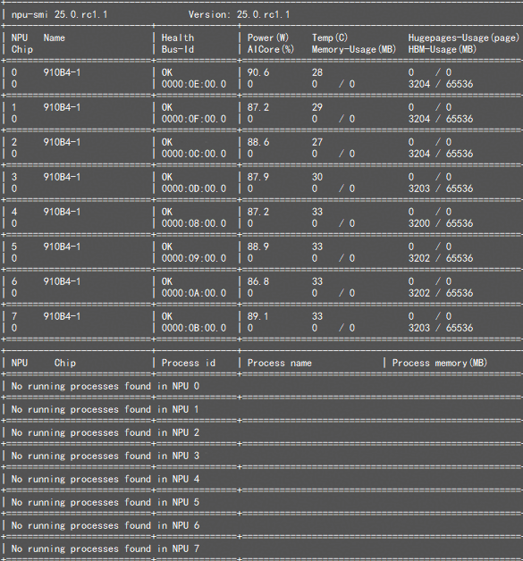

      执行以下命令会在当前执行目录下生成例如"yyyy-MM-dd-HH-mm-ss"的日志目录。
      
      ```bash
      msnpureport
      ```

      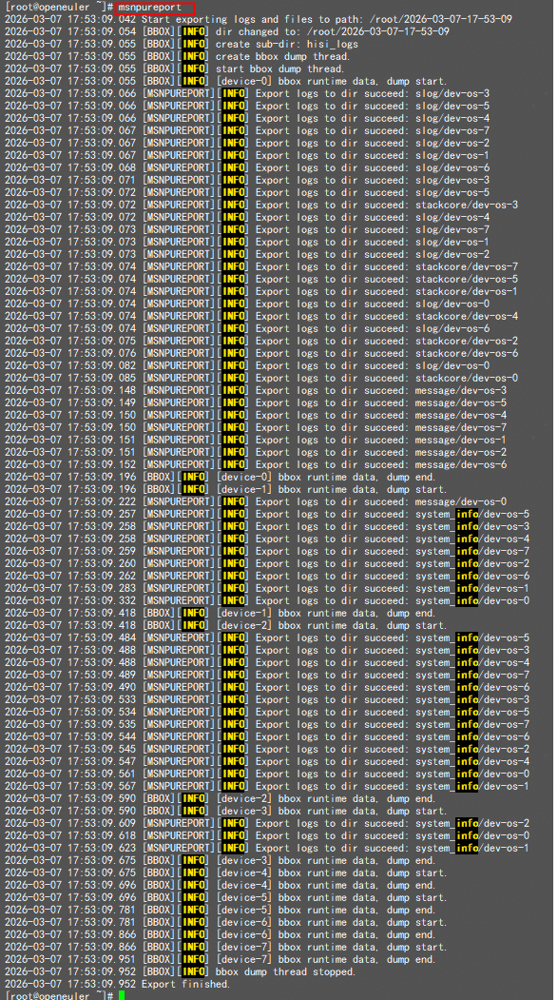

      ```bash
      grep -nr "Device capability info" <日志目录名称>
      ```

      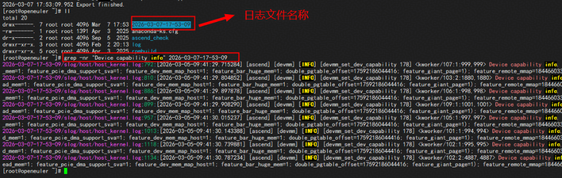

      发现“feature_bar_mem=1”内容，即表示write combing已开启。

      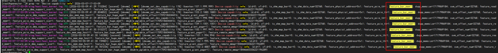
  2. 配置 QEMU。
      - 若 write combing 已开启，则环境上的 qemu 不需要打 patch。
      - 若 write combing 未开启，参考[Write Combining 性能优化](https://www.hiascend.com/document/detail/zh/Atlas%20200I%20A2/2550/re/virtualmachineconfiguration/topic_0000002482818233.html)，修改内核以及 QEMU 代码实现该优化。

#### cpu 绑核优化

- 原理介绍
  
  CPU 一对一绑核能换来 vCPU 稳定、低延迟和更高缓存命中率，降低调度开销，提高虚拟机的性能;CPU 绑核会牺牲物理机 CPU 的弹性和利用率，需要用户自行权衡资源利用率和虚拟机的性能。

- 配置方法

  1. 进入虚机执行命令，打开并修改虚机的 XML 定义文件

      ```bash
      # 此处<vm_name>为用户虚拟机名称
      virsh edit <vm_name>
      ```

  2. 手动配置每一个 cpuset（物理 CPU）唯一对应一个 vCPU（虚拟 CPU）。
      
      示例：物理机上 CPU 编号有 0-191

      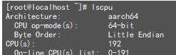

      虚拟机 XML 中配置`cputune`，配置 192 个`vcpupin`,其中 cpuset 依次为 0-191，vCPU 依次为 0-191，cpuset 与 vcpu 一一对应。

      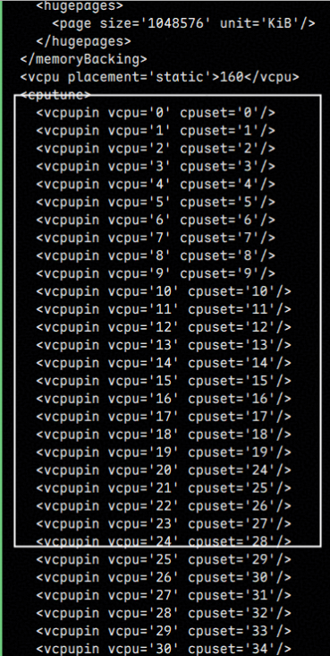

  3. 保存 xml 修改的内容并重启虚拟机。

      ```bash
      virsh reboot openeuler
      ```

#### NUMA NPU 亲和绑定

- 原理介绍

  物理机上 NPU 与 NUMA 之间存在亲和关系，令 NPU 优先使用同一个 NUMA 节点内的 CPU；将该特性在虚拟机内使能，与物理机保持一致，不影响正常业务场景。

- 配置方法

  1. 获取物理机上 NPU 的 PCI 号。

      ```bash
      lspci | grep d802 
      # 其中 A2 为 d802，A3 为 d803
      ```

      示例如下：

      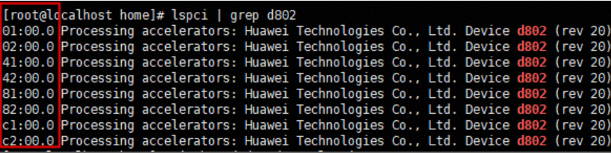

  2. 在 XML 中查询物理机的 PCI 和虚拟机的 PCI 对应关系。

      执行以下命令，通过 source 内 address 中的 bus 来找到该 NPU 对应的虚拟机映射 PCI，因为该 bus 是和步骤 1 的 PCI 号一一对应，比如第一个 NPU 的 PCI 号是 01:00.0，这里`bus`就是 0x01,<`Device`>.<`Function`>为 00.0

      ```bash
      virsh edit <vm_name>
      # 此处<vm_name>为用户虚拟机名称
      ```

      示例如下：

      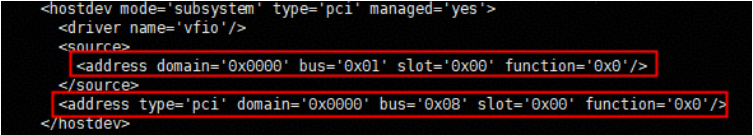
  3. 查看物理机 NPU 的 NUMA 号。

      ```bash
      cd /sys/bus/pci/devices
      cat <domain>\:<Bus>\:<Device>.<Function>/numa_node
      ```

      其中，

      ```xml
      <domain>\:<Bus>\:<Slot>.<Function>
      ```

      是根据 lspci 得到的 PCI 号。
      示例如下：

      ```shell
      01:00.0 Processing accelerators: Huawei Technologies Co., Ltd. Device d802 (rev 20)
      ```

      此处 01:00.0 设备，domain 为 0000，Bus 为 01，Slot.Function 为 00.0;
      
      查看其 NUMA 号：

      ```bash
      cat /sys/bus/pci/devices/0000\:02\:00.0/numa_node
      ```

      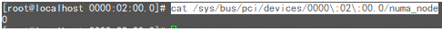

      上图说明该设备在物理机上绑定的 numa 为 0

  4. 进入到虚拟机中/sys/bus/pci/devices 目录下，查看该 NPU 在虚拟机上的绑定的 NUMA，返回信息 -1，即表示现在还没有绑定

      ```bash
      cd /sys/bus/pci/devices
      cat <domain>\:<Bus>\:<Device>.<Function>/numa_node
      ```

      示例如下：

      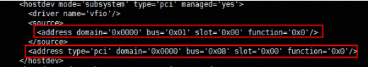

      虚拟机 xml 中 hostdev 字段中，直通的 NPU 设备 PCI 地址中，domain 为 0000，Bus 为 08，Slot.Function 为 00.0
      
      查看其 NPU 设备绑定 numa：

      ```bash
      cd /sys/bus/pci/devices
      cat 0000\:08\:00.0/numa_node
      ```

      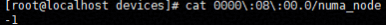

  5. 为虚机上没绑定 NUMA 的 NPU，绑定相应的 NUMA，建议一一对应。

      ```bash
      echo "<numa_num>"> /sys/bus/pci/devices/<domain>\:<Bus>\:<Slot>.<Function>/numa_node
      cat <domain>\:<Bus>\:<Slot>.<Function>/numa_node
      ```

      其中，

      ```bash
      <domain>\:<Bus>\:<Slot>.<Function>
      ```

      为虚拟机的 NPU 设备地址，numa_num 为物理机上与虚拟机一一对应的 NPU 设备，将虚拟机上 NPU 设备绑定的 NUMA 配置为与物理机一致。

  6. 重复以上操作，在虚拟机中，为所有直通虚拟机的 NPU 绑定 NUMA，能够有效减少性能劣化。

#### Halt-Poll

- 原理介绍

  通过修改虚拟机中 guest_halt_poll_allow_shrink、cpuidle_haltpoll 和 guest_halt_poll_ns 配置项，能够减少 VM-exit/entry 次数，降低唤醒延迟；但物理机上分配给虚拟机的 CPU 会被占用更多、功耗上升，该优化项每次虚拟机重启失效。

- 配置方法

  在虚拟机中执行以下操作：

  ```bash
  echo Y > /sys/module/cpuidle_haltpoll/parameters/force
  echo 2000000000 > /sys/module/haltpoll/parameters/guest_halt_poll_ns
  echo N > /sys/module/haltpoll/parameters/guest_halt_poll_allow_shrink
  ```

  查看操作是否生效。

  ```bash
  cat /sys/module/cpuidle_haltpoll/parameters/force
  cat /sys/module/haltpoll/parameters/guest_halt_poll_ns
  cat /sys/module/haltpoll/parameters/guest_halt_poll_allow_shrink 
  ```

#### HugePage 2M 优化

- 原理介绍

  将虚拟机大页设置成 2M，减少页表层次和 TLB 压力，提高内存访问效率;该特性不影响正常业务场景。

- 配置方法

  1. 进入虚拟机编辑 GRUB 文件，配置大页数目。
    
      执行以下命令编辑 GRUB 文件

      ```bash
      vi /etc/default/grub
      ```

      按“i”进入编辑模式，在 GRUB_CMDLINE_LINUX 项的末尾加入以下参数：

      ```shell
      default_hugepagesz=2M hugepagesz=2M hugepages=pageNums
      ```

      其中，pageNums 为需要自定义所需分配的大页数目。

      按“Esc”，输入“:wq！”保存并退出。

  2. 执行以下命令查询虚拟机启动方式。

      ```bash
      sudo dmesg | grep -i "efi"
      ```

      返回信息示例如下：

      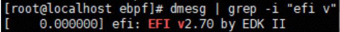

      若返回信息中显示 EFI 相关信息，如上图返回信息示例所示即表示 UEFI 启动，否则为 BIOS 启动。确定启动方式后，执行以下命令使配置生效。
      若为 UEFI：

      ```bash
      grub2-mkconfig -o /boot/efi/EFI/openEuler/grub.cfg
      ```

      若为 BIOS：

      ```bash
      grub2-mkconfig -o /boot/grub2/grub.cfg
      ```

  3. 重启虚拟机，重启后执行以下命令检查 2M 大页是否配置生效。

      ```bash
      cat /proc/meminfo | grep Hugepagesize
      ```

  4. 推理的时候执行以下命令添加环境变量，使能 2M 大页推理的优化。

      ```bash
      export GLIBC_TUNABLES=glibc.malloc.hugetlb=2
      ```

#### QEMU 进程隔离

- 原理介绍

  通过该方式能够让不同的虚拟机进程、关键业务进程运行在不同的物理/逻辑 CPU 上，防止互相抢占 CPU 资源。该特性不影响正常业务场景，QEMU 进程重启后失效。

- 配置方法
  执行 taskset 命令，将指定的 QEMU 虚拟机进程绑定到特定的 CPU 上运行。

    ```bash
    taskset -cp <CPU_ID> <QEMU_ID>
    ```

#### vCPU 隔离独占

设置 vCPU 隔离独占使得虚拟机的 CPU 不再被物理机任务频繁抢占，减少上下文切换和 VM-exit/entry 开销。vCPU 隔离会导致物理机 CPU 被虚拟机完全独占，降低多虚拟机场景下的 CPU 复用率，追求最高性能的场景可以开启本特性，谨慎开启。

1. 编辑 GRUB 文件，进行虚机 CPU 分配配置。

    执行以下命令编辑 GRUB 文件。

    ```bash
    vi /etc/default/grub
    ```

    按“i”进入编辑模式，在 GRUB_CMDLINE_LINUX 项的末尾加入以下参数。

    ```shell
    isolcpus=<分配给虚拟机的 cpu>
    nohz_full=<分配给虚拟机的 cpu> 
    rcu_nocbs=<分配给虚拟机的 cpu>
    ```

    其中，<分配给虚拟机的 cpu>需要根据实际创建的虚拟机规格进行配置。
    按“Esc”，输入“:wq！”保存并退出。

2. 执行以下命令查询物理机启动方式。

    ```bash
    sudo dmesg | grep -i "efi"
    ```

    返回信息示例如下：

    

    若返回信息中显示 EFI 相关信息，如上图返回信息示例所示即表示 UEFI 启动，否则为 BIOS 启动。确定启动方式后，执行以下命令使配置生效。
    
    - UEFI 启动

      ```bash
      grub2-mkconfig -o /boot/efi/EFI/openEuler/grub.cfg
      ```

    - BIOS 启动

      ```bash
      grub2-mkconfig -o /boot/grub2/grub.cfg
      ```

3. 重启物理机，重启后执行以下命令检查配置是否生效。

      ```bash
      cat /proc/cmdline
      ```

#### GICv4.1

- 前置条件

  该优化项存在一定约束条件，鲲鹏芯片仅 920B 型号和 920C 型号可额外支持 GICv4.1

- 优化方法

  1. 配置 GIC Version。
    
      重启物理机，在开机自检时进入 BIOS。在路径 Advanced > Processor Configuration > GIC Version 中将 GIC Version 设置为 4.1。

  2. 编辑 GRUB 文件，以使能 GICv4.1。
      执行以下命令编辑 GRUB 文件。

      ```bash
      vi /etc/default/grub
      ```

      按“i”进入编辑模式，在 GRUB_CMDLINE_LINUX 项的末尾加入以下参数。

      ```bash
      kvm-arm.vgic_v4_enable=1
      ```

      按“Esc”，输入“:wq！”保存并退出。

  3. 执行以下命令查询物理机启动方式。

      ```bash
      sudo dmesg | grep -i "efi"
      ```
      
      返回信息示例如下：

      

      若返回信息中显示 EFI 相关信息，如上图返回信息示例所示即表示 UEFI 启动，否则为 BIOS 启动。确定启动方式后，执行以下命令使配置生效。
      
      - UEFI 启动

        ```bash
        grub2-mkconfig -o /boot/efi/EFI/openEuler/grub.cfg
        ```

      - BIOS 启动

        ```bash
        grub2-mkconfig -o /boot/grub2/grub.cfg
        ```

  4. 重启物理机，重启后执行以下命令检查配置是否生效。

      ```bash
      cat /proc/cmdline | grep vgic_v4_enable
      ```

### 场景 2 昇腾 NPU+ 鲲鹏 CPU 的协同计算架构场景

#### WriteCombine 优化

- 原理介绍

  `WC`（Write Combining，写合并）是一种提升主机向非缓存 PCIe 设备写入性能的技术。写入 WC 区域的数据会暂存于 64 字节缓冲区，待缓冲区填满或触发刷新事件（如写入地址超出当前缓冲区范围）时，执行合并写入，显著提升总线利用率，实现更高吞吐量。该特性在当前约束限制下的物理机上默认开启，本章节主要指导用户如何开启虚拟机内的 WC 特性，用户需要修改物理机内核代码、QEMU 代码后重新编译安装。

- 配置方法

  1. 虚拟机内验证 write combing 是否开启。
      
      a. 确保虚拟机内安装了 NPU Driver 驱动，可以通过`npu-smi info`查询到所有 NPU 信息后。

        ```bash
        npu-smi info
        ```

        NPU 信息示例如下：
        
        

      b. 执行以下命令会在当前执行目录下生成例如"yyyy-MM-dd-HH-mm-ss"的日志目录。
       
        ```bash
        msnpureport
        ```

        

        ```bash
        grep -nr "Device capability info" <日志目录名称>
        ```

        
      c. 发现“feature_bar_mem=1”内容，即表示 write combing 已开启。

        
  
  2. QEMU 配置。

      - 若 write combing 已开启，则环境上的 qemu 不需要安装 patch。
      - 若 write combing 未开启，参考[Write Combining 性能优化](https://www.hiascend.com/document/detail/zh/Atlas%20200I%20A2/2550/re/virtualmachineconfiguration/topic_0000002482818233.html)，修改内核以及 QEMU 代码实现该优化。

#### CPU 绑核优化

- 原理介绍

  CPU 一对一绑核能换来 vCPU 稳定、低延迟和更高缓存命中率，降低调度开销，提高虚拟机的性能;CPU 绑核会牺牲物理机 CPU 的弹性和利用率，需要用户自行权衡资源利用率和虚拟机的性能。

- 配置方法
  1. 进入虚机执行命令，打开并修改虚机的 XML 定义文件

      ```bash
      virsh edit <vm_name>
      # 此处<vm_name>为用户虚拟机名称
      ```

  2. 手动让每一个 cpuset（物理 CPU）唯一对应一个 vCPU（虚拟 CPU）。
    
      示例：物理机上 CPU 编号有 0-191

      

      虚拟机 XML 中配置`<cputune>`，配置 192 个`<vcpupin>`,其中 cpuset 依次为 0-191，vCPU 依次为 0-191，cpuset 与 vcpu 一一对应。

      

  3. 保存 xml 修改并重启虚拟机。

      ```bash
      virsh reboot openeuler
      ```

#### NUMA NPU 亲和绑定

- 原理介绍

    物理机上 NPU 与 NUMA 之间存在亲和关系，令 NPU 优先使用同一个 NUMA 节点内的 CPU；将该特性在虚拟机内使能，与物理机保持一致，不影响正常业务场景。

- 配置方法

  1. 获取物理机上 NPU 的 PCI 号

      ```bash
      lspci | grep d802 
      # 其中 A2 为 d802，A3 为 d803
      ```

      示例如下：

      

  2. 在 XML 中查询物理机的 PCI 和虚拟机的 PCI 对应关系。
      
      执行以下命令，通过 source 内 address 中的 bus 来找到该 NPU 对应的虚拟机映射 PCI，因为该 bus 是和步骤 1 的 PCI 号一一对应，比如第一个 NPU 的 PCI 号是 01:00.0，这里 bus 就是 0x01

        ```bash
        virsh edit <vm_name>
        # 此处<vm_name>为用户虚拟机名称
        ```

      示例如下：

      

  3. 查看物理机 NPU 的 NUMA 号

      ```bash
      cd /sys/bus/pci/devices
      cat <domain>\:<Bus>\:<Device>.<Function>/numa_node
      ```

      其中，

      ```xml
      <domain>\:<Bus>\:<Slot>.<Function>
      ```

      是根据 lspci 得到的 PCI 号。示例如下：
      
      ```bash
      01:00.0 Processing accelerators: Huawei Technologies Co., Ltd. Device d802 (rev 20)
      ```

      此处 01:00.0 设备，domain 为 0000，Bus 为 01，Slot.Function 为 00.0；查看其 NUMA 号：

      ```bash
      cat /sys/bus/pci/devices/0000\:02\:00.0/numa_node
      ```

      

      该设备在物理机上绑定的 numa 为 0。

  4. 进入到虚拟机中/sys/bus/pci/devices 目录下，查看该 NPU 在虚拟机上的绑定的 NUMA，返回信息 -1，即表示现在还没有绑定

      ```bash
      cd /sys/bus/pci/devices
      cat <domain>\:<Bus>\:<Device>.<Function>/numa_node
      ```

      示例如下：

      

      虚拟机 xml 中 hostdev 字段中，直通的 NPU 设备 PCI 地址中，domain 为 0000，Bus 为 08，Slot.Function 为 00.0；查看其 NPU 设备绑定 NUMA。

      ```bash
      cd /sys/bus/pci/devices
      cat 0000\:08\:00.0/numa_node
      ```

      

  5. 为虚机上没绑定 NUMA 的 NPU，绑定相应的 NUMA，建议一一对应。

      ```bash
      echo "<numa_num>"> /sys/bus/pci/devices/<domain>\:<Bus>\:<Slot>.<Function>/numa_node
      cat <domain>\:<Bus>\:<Slot>.<Function>/numa_node
      ```

      其中，

      ```bash
      <domain>\:<Bus>\:<Slot>.<Function>
      ```

      为虚拟机的 NPU 设备地址，numa_num 为物理机上与虚拟机一一对应的 NPU 设备，将虚拟机上 NPU 设备绑定的 NUMA 配置为与物理机一致。
  6. 重复以上操作，在虚拟机中，为所有直通虚拟机的 NPU 绑定 NUMA，能够有效减少性能劣化。

#### CPU 空闲处理优化

- 原理介绍

  配置 idle=pool，让 vCPU 空闲时“原地等”，而不是频繁睡眠/唤醒，用 CPU 换低抖动和低时延；物理机上分配给虚拟机的 CPU 会被占用更多、功耗上升，每次虚拟机重启失效。

- 配置方法

  1. 进入虚拟机编辑 GRUB 文件，执行以下命令编辑 GRUB 文件。
      
      ```bash
      sudo dmesg | grep -i "efi"
      ```

      返回信息示例如下：

      

      若返回信息中显示 EFI 相关信息，如上图返回信息示例所示即表示以 UEFI 方式启动，否则为 BIOS 启动。确定启动方式后，执行以下命令使配置生效。
      - UEFI 启动

        ```bash
        grub2-mkconfig -o /boot/efi/EFI/openEuler/grub.cfg
        ```

      - BIOS 启动

        ```bash
        grub2-mkconfig -o /boot/grub2/grub.cfg
        ```

  2. 重启虚拟机，重启以后执行以下命令检查“idle=pool”配置是否生效。

      ```bash
      cat /proc/cmdline
      ```

#### HugePage 2M 优化

- 原理介绍

  将虚拟机大页设置成 2M，减少页表层次和 TLB 压力，提高内存访问效率;该特性不影响正常业务场景。

- 配置方法

  1. 进入虚拟机编辑 GRUB 文件，配置大页数目。
      
      执行以下命令编辑 GRUB 文件。

      ```bash
      vi /etc/default/grub
      ```

      按“i”进入编辑模式，在 GRUB_CMDLINE_LINUX 项的末尾加入以下参数

      ```shell
      default_hugepagesz=2M hugepagesz=2M hugepages=pageNums
      ```

      其中，pageNums 为需要自定义所需分配的大页数目。

      完成修改后，按“Esc”，输入“:wq！”保存并退出。

  2. 执行以下命令查询虚拟机启动方式。

      ```bash
      sudo dmesg | grep -i "efi"
      ```

      返回信息示例如下：

      

      若返回信息中显示 EFI 相关信息，如上图返回信息示例所示即表示以 UEFI 方式启动，否则为 BIOS 启动。确定启动方式后，执行以下命令使配置生效。
      - UEFI 启动

        ```bash
        grub2-mkconfig -o /boot/efi/EFI/openEuler/grub.cfg
        ```

      - BIOS 启动

        ```bash
        grub2-mkconfig -o /boot/grub2/grub.cfg
        ```

  3. 重启虚拟机，重启后执行以下命令检查 2M 大页是否配置生效。

      ```bash
      cat /proc/meminfo | grep Hugepagesize
      ```

  4. 推理的时候执行以下命令添加环境变量，使能 2M 大页推理的优化。

      ```bash
      export GLIBC_TUNABLES=glibc.malloc.hugetlb=2
      ```

#### vCPU 隔离独占优化

- 原理介绍
  
  设置 vCPU 隔离独占使得虚拟机的 CPU 不再被物理机任务频繁抢占，减少上下文切换和 VM-exit/entry 开销。vCPU 隔离会导致物理机 CPU 被虚拟机完全独占，降低多虚拟机场景下的 CPU 复用率，追求最高性能的场景可以开启本特性，谨慎开启。

- 配置方法

  1. 编辑 GRUB 文件，进行虚机 CPU 分配配置。
    
      执行以下命令编辑 GRUB 文件。

      ```bash
      vi /etc/default/grub
      ```

      按“i”进入编辑模式，在 GRUB_CMDLINE_LINUX 项的末尾加入以下参数。

      ```bash
      isolcpus=<分配给虚拟机的 cpu>
      nohz_full=<分配给虚拟机的 cpu> 
      rcu_nocbs=<分配给虚拟机的 cpu>
      ```

      其中，<分配给虚拟机的 cpu>需要根据实际创建的虚拟机规格进行配置。
      
      完成修改后，按“Esc”，输入“:wq！”保存并退出。

  2. 执行以下命令查询物理机启动方式。

      ```bash
      sudo dmesg | grep -i "efi"
      ```

      返回信息示例如下：

      

      若返回信息中显示 EFI 相关信息，如上图返回信息示例所示即表示以 UEFI 方式启动，否则为 BIOS 启动。确定启动方式后，执行以下命令使配置生效。
      - UEFI 启动

        ```bash
        grub2-mkconfig -o /boot/efi/EFI/openEuler/grub.cfg
        ```

      - BIOS 启动

        ```bash
        grub2-mkconfig -o /boot/grub2/grub.cfg
        ```

  3. 重启物理机，重启后执行以下命令检查配置是否生效。

      ```bash
      cat /proc/cmdline
      ```

#### 大模型推理进程绑核

- 原理介绍

  对高 CPU 占用的 mindie 推理进程进行合理的绑核，以减少迁移延迟，设置 CPU 策略实时优先，避免线程频繁迁移，保持 CPU 缓存命中率，进而 NPU 数据从 CPU 内存传输更稳定，提示推理吞吐。
- 配置方法
  
  下面以 mindie 大模型推理服务为例，说明进程优化实现。
  
  1. 虚拟机的容器内完成 mindie 大模型推理进程服务启动后，创建 optimizer_minidie_process.sh 脚本。

      a. 创建optimizer_minidie_process.sh脚本文件。

        ```bash
        vi optimizer_minidie_process.sh
        ```
        
      b. 按“i”进入编辑模式，添加以下内容。

      ```shell
      #!/bin/bash
      set -euo pipefail
      
      PROCESS_NAME="mindie_llm_backend"   # mindie推理进程名
      CPUS_PER_PID=2                      # 给每个进程分配 CPU 数
      CPU_THRESHOLD=5                     # 只绑定 CPU 占用率 >5% 的进程
      
      echo "===mindie_llm_backend bind vcpu start==="
      
      if ! command -v taskset >/dev/null 2>&1; then
          echo "[ERROR]：Taskset not found"
          exit 1
      fi
      
      TOTAL_CPUS=$(lscpu | awk -F: '/^CPU\(s\)/{print $2}' | tr -d ' ')
      ALL_CPUS=($(seq 0 $((TOTAL_CPUS - 1))))
      
      echo "[INFO]The num of total vcpu is: $TOTAL_CPUS"
      echo "[INFO]CPU list is ${ALL_CPUS[*]}"
      
      ALL_PIDS=($(pgrep -f "$PROCESS_NAME" || true))
      if [ ${#ALL_PIDS[@]} -eq 0 ]; then
          echo "[WARNING]Can not find any process $PROCESS_NAME"
          exit 0
      fi
      
      PIDS=()
      for pid in "${ALL_PIDS[@]}"; do
          cpu_usage=$(ps -p "$pid" -o %cpu= | awk '{print int($1)}')
          if [ "$cpu_usage" -ge "$CPU_THRESHOLD" ]; then
              PIDS+=("$pid")
          fi
      done
      
      if [ ${#PIDS[@]} -eq 0 ]; then
          echo "[WARNING]No process $PROCESS_NAME cpu usage larger than percent 5"
          exit 0
      fi
      
      
      REQUIRED=$(( ${#PIDS[@]} * CPUS_PER_PID ))
      if [ $REQUIRED -gt $TOTAL_CPUS ]; then
          echo "[ERROR]：The num of vcpu is not enough"
      fi
      
      idx=0
      for pid in "${PIDS[@]}"; do
          start=$idx
          end=$((idx + CPUS_PER_PID - 1))
          cpus=$(seq -s, $start $end)
          echo "Bind PID=$pid → CPU: $cpus"
          taskset -pc "$cpus" "$pid"
      
          idx=$((idx + CPUS_PER_PID))
      done
      
      echo "===mindie_llm_backend bind vcpu end==="
      ```

      c. 完成修改后，按“ESC”，输入:wq!。按“Enter”保存并退出。

  2. 执行 optmize_mindie_process.sh 脚本。

      ```bash
      bash optmize_mindie_process.sh
      ```

      返回信息示例如下图所示，即表示正确完成绑核，并对进程设置 CPU 策略实时优先。

      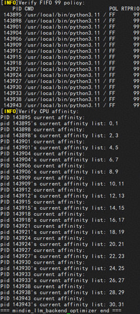

#### Linux CPU 调度优化

- 原理介绍

  该优化项目针对服务器专注大模型推理任务，无其他高 I/O 任务的场景进行针对优化，停止 Linux 的中断负载均衡服务，避免该服务自动把硬件中断分配到不同 CPU 核心上，将中断固定在当前 CPU 核心，避免跨核延迟，提高实时性。同时，该优化项通过修改 linux 自带的系统性能调优守护进程 tuned 的配置方案，进行 CPU 响应速度提升。
- 配置方法

1. 大模型推理服务启动前需在物理机执行以下操作：

    a.关闭对 CPU 的中断自动分配。

      ```bash
      systemctl stop irqbalance
      ```

    b.修改 tunned 进程为低延迟模式。

      ```bash
      tuned-adm profile latency-performance
      ```

2. 大模型推理服务启动前需在虚拟机执行以下操作：

    a.关闭对 CPU 的中断自动分配。

    ```bash
    systemctl stop irqbalance
    ```

    b.修改 tunned 进程为低延迟模式。

    ```bash
    tuned-adm profile latency-performance
    ```

#### NUMA 特性优化

- 原理介绍

    该优化项目通过 numa 特性和大页内存分配进行修改，实现性能优化。在内存充足的情况下，取消 numa 区域回收，可减少跨节点访问延迟；同时更改 linux 内核内存管理参数，分配策略参数，降低内存页换出到 swap 的积极程度，减少内存换出，让推理速度提高。
- 配置方法

大模型推理服务启动前，在虚拟机执行以下操作：

1. 关闭 NUMA 区域回收，减少跨节点访问延迟。

    ```bash
    sysctl -w vm.zone_reclaim_mode=0
    ```

2. 配置内核参数，降低使用内存换出到 swap 的积极程度。

    ```bash
    sysctl -w vm.swappiness=0
    ```

#### Linux 内存策略优化

- 原理介绍
  
  该优化项目通过整内核内存地址布局策略，减少内存地址随机化操作，可降低加载和初始化延迟，提升推理服务的响应速度。同时通过调整内核大页共享扫描策略，停止 KSM 页面扫描，减少页面合并带来的内存访问开销。
- 配置方法

大模型推理服务启动前，在虚拟机执行以下操作：

1. 调整地址空间布局随机化。

    ```bash
    echo 0 > /proc/sys/kernel/randomize_va_space
    ```

2. 停止 KSM 页面扫描。

    ```bash
    echo 0 > /sys/kernel/mm/ksm/pages_to_scan
    ```
