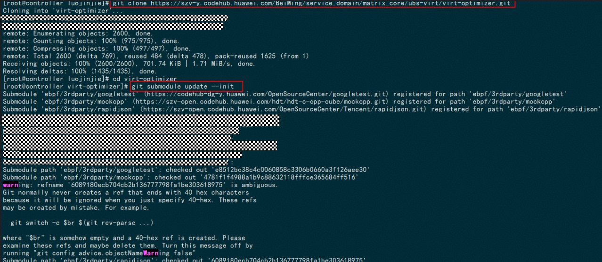
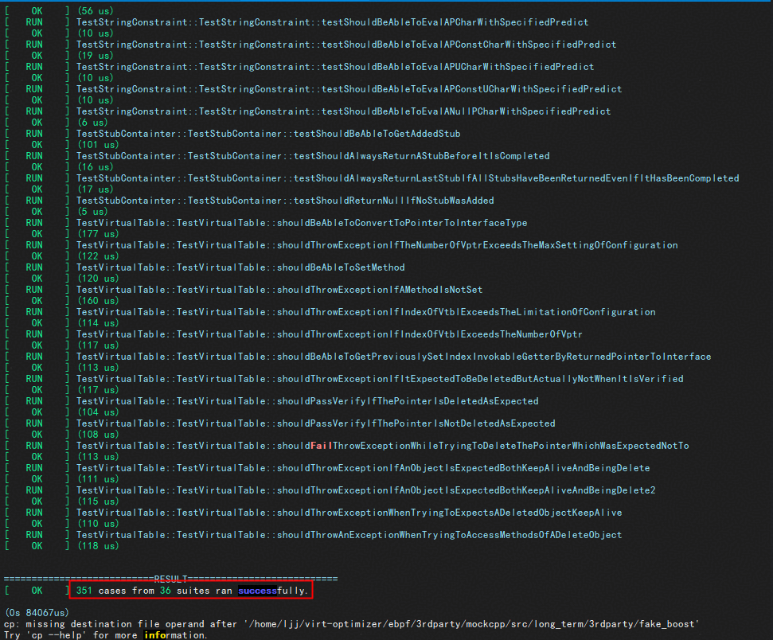

### 单元侧开发指南
#### 1 前置动作
##### 1.1 环境依赖
* **操作系统：** openEuler 22.03 LTS SP3/TencentOS Server 3.1
* **CPU架构：** aarch64/x86
* **用户权限：** 安装与管理需 `root` 权限
* **软件要求：**
```
CMake ≥ 3.22.0
googletest ≥ 1.10.0
rapidjson  ≥ 1.2.0
clang ≥ 12.0.1
libbpf-devel ≥ 0.8.1
bpftool ≥ 6.8.0

```
##### 1.2 拉取工程文件
a.拉取ubs-optimizer，进入virt-optimizer目录：
```
git clone https://gitcode.com/openeuler/ubs-virt.git
cd ubs-virt/virt-optimizer
```
b.拉取ubs-optimizer三方件
```
git submodule update --init
```
示例如下：

!

c.备份原build.sh，并修改build.sh为以下内容：

```
#!/bin/bash
set -e
usage() {
echo "Usage: $0 [ -h | --help ] [ -t | --type <build_type> ]"
echo "build_type: [debug, release]"
echo
echo "Examples:"
echo " 1 ./build.sh -t debug"
echo " 3 ./build.sh -t release"
echo
exit 1;
}
BUILD_PATH=
BUILD_TYPE=Release
BUILD_FOLDER=release
CURRENT_PATH=$(cd "$(dirname "$0")"; pwd)
while true; do
case "$1" in
-t | --type )
type=$2
type=${type,,}
[[ $type != "debug" && $type != "release" ]] && echo "Invalid build type
$2" && usage
if [[ $type == 'debug' ]]; then
BUILD_TYPE=Debug
BUILD_FOLDER=debug
CMAKE_FLAGS+='-DBUILD_TEST=ON'
elif [[ $type == 'release' ]]; then
BUILD_TYPE=Release
BUILD_FOLDER=release
CMAKE_FLAGS+='-DBUILD_TEST=OFF'
fi
shift 2
;;
-h | --help )
usage
exit 0
;;
* )
break;;
esac
done
if [[ ${BUILD_TYPE} == 'Debug' ]]; then
MOCKCPP_PATH="${CURRENT_PATH}/ebpf/3rdparty/mockcpp"
cd ${MOCKCPP_PATH}/src/long_term
sh build.sh
cp -rf ${MOCKCPP_PATH}/src/long_term/include ${MOCKCPP_PATH}
if [ ! -d "${MOCKCPP_PATH}/include/fake_boost" ]; then
cp -rf ${MOCKCPP_PATH}/src/long_term/3rdparty/fake_boost
${MOCKCPP_PATH}/include
fi
if [ ! -d "${MOCKCPP_PATH}/include/msinttypes" ]; then
cp -rf ${MOCKCPP_PATH}/src/long_term/3rdparty/msinttypes
${MOCKCPP_PATH}/include
fi
if [ ! -d "${MOCKCPP_PATH}/lib" ]; then
mkdir ${MOCKCPP_PATH}/lib
fi
cp -rf ${MOCKCPP_PATH}/src/long_term/build_GNU/mockcpp/src/libmockcpp.a
${MOCKCPP_PATH}/lib/libmockcpp.a
fi
if [ -z "${BUILD_PATH}" ]; then
BUILD_PATH=${CURRENT_PATH}/ebpf/build/${BUILD_FOLDER}
fi
if [ -d "${BUILD_PATH}" ]; then
rm -rf "${BUILD_PATH}"
fi
# 引入vmlinux.h
USR_VMLINUX_H_PATH="/usr/include/vmlinux.h"
VMLINUX_H_PATH="${CURRENT_PATH}"/ebpf/src/client/bpfs/vmlinux.h
if [[ ! -f "${VMLINUX_H_PATH}" && ! -f "${USR_VMLINUX_H_PATH}" ]]; then
# 导出 vmlinux.h
if ! sudo bpftool btf dump file /sys/kernel/btf/vmlinux format c >
"${VMLINUX_H_PATH}"; then
# 导出命令执行失败也会生成一个空的vmlinux.h文件，这里删除这个文件
if [ -f "${VMLINUX_H_PATH}" ]; then
rm -f "${VMLINUX_H_PATH}"
fi
echo "Failed to dump vmlinux.h"
exit 1
fi
3. 进入到 ebpf/tests/ 将其中的CMakeLists.txt，更新为：
echo "vmlinux.h dumped successfully."
else
echo "vmlinux.h already exists."
fi
mkdir -p "${BUILD_PATH}" && cd "${BUILD_PATH}"
if ! cmake ../.. -DCMAKE_BUILD_TYPE=$BUILD_TYPE; then
echo "cmake failed."
exit 1
fi
echo "cmake success."
if ! make; then
echo "make failed."
exit 1
fi
echo "make success."
# 构建rpm包
cd ${CURRENT_PATH}
mkdir -p ${CURRENT_PATH}/ebpf/rpm/usr/local/sbin/virt-optimizer
cp -rf ${CURRENT_PATH}/ebpf/build/${BUILD_FOLDER}/src/client/lib
${CURRENT_PATH}/ebpf/rpm/usr/local/sbin/virt-optimizer
cp -rf ${CURRENT_PATH}/collector_metric ${CURRENT_PATH}/ebpf/rpm
cp -f ${CURRENT_PATH}/ebpf/build/${BUILD_FOLDER}/src/client/virt-opt
${CURRENT_PATH}/ebpf/rpm/usr/local/sbin
cp -f ${CURRENT_PATH}/ebpf/build/${BUILD_FOLDER}/src/server/virt-opt-guard
${CURRENT_PATH}/ebpf/rpm/usr/local/sbin
cp -f ${CURRENT_PATH}/ebpf/build/${BUILD_FOLDER}/src/optimizer/virt-opt-tuner
${CURRENT_PATH}/ebpf/rpm/usr/local/sbin
cp -f ${CURRENT_PATH}/ebpf/src/default_config.json
${CURRENT_PATH}/ebpf/rpm/usr/local/sbin/virt-optimizer/config.json
/usr/bin/tar -C ./ebpf -zcf virt_optimizer.tar.gz ./rpm/
rm -rf ${CURRENT_PATH}/ebpf/rpm
mkdir -p ~/rpmbuild/SOURCES/
cp virt_optimizer.tar.gz ~/rpmbuild/SOURCES/
rpmbuild --define "package_name virt_optimizer" -bb virt_optimizer.spec
cp ~/rpmbuild/RPMS/$(uname -m)/virt-optimizer-0.1.0-k5.1.aarch64.rpm virt-optimizer-
0.1.0-k5.1-$(uname -m).rpm

```

d.进入到 ebpf/tests/目录，将其中的CMakeLists.txt，更新为:

```
file(GLOB_RECURSE SERVER_SOURCE
"${CMAKE_CURRENT_SOURCE_DIR}/*.cpp"
)
add_executable(test-all ${SERVER_SOURCE} )
set_source_files_properties(
${SERVER_SOURCE}
PROPERTIES
COMPILE_FLAGS "-g -O0 -fstack-protector-all -fstack-protector-strong -Wextra -
Wfloat-equal -fno-common -fprofile-arcs -ftest-coverage -fexceptions"
)
target_include_directories(test-all PRIVATE
"${CMAKE_CURRENT_SOURCE_DIR}" "${PROJECT_SOURCE_DIR}/3rdparty/rapidjson/include"
"${PROJECT_SOURCE_DIR}/3rdparty/mockcpp/include" "${PROJECT_SOURCE_DIR}/src"
"${PROJECT_SOURCE_DIR}/src/common"
"${libbpf_INCLUDE_DIRS}" "${CMAKE_CURRENT_SOURCE_DIR}/mock"
)
# 突破控制权限访问，使得可以mock私有函数
target_compile_options(test-all PRIVATE -fno-access-control)
TARGET_LINK_LIBRARIES(test-all virt-opt-lib virt-opt-guard-lib gtest
${PROJECT_SOURCE_DIR}/3rdparty/mockcpp/lib/libmockcpp.a ${libbpf_LIBRARIES}
${ELF_LIBRARIES}
${zlib_LIBRARIES}
-lelf
-lz
-lgcov
)

```


##### 1.3 进行UT开发及验证
a.新增UT代码，并上传至环境中的virt-optimizer/ebpf/test目录下

b.进入virt-optimizer目录，执行以下命令，完成基本的debug包编译

```
find . -type f -not -path '*/\.*' -exec grep -Il '.' {} \; | xargs -d '\n' -L 1 dos2unix -k
bash build.sh -t debug
```

d.进入到virt-optimizer/ebpf/目录执行以下命令，运行UT，获取UT运行情况

```
bash run_ut.sh
```
执行示例如下:


