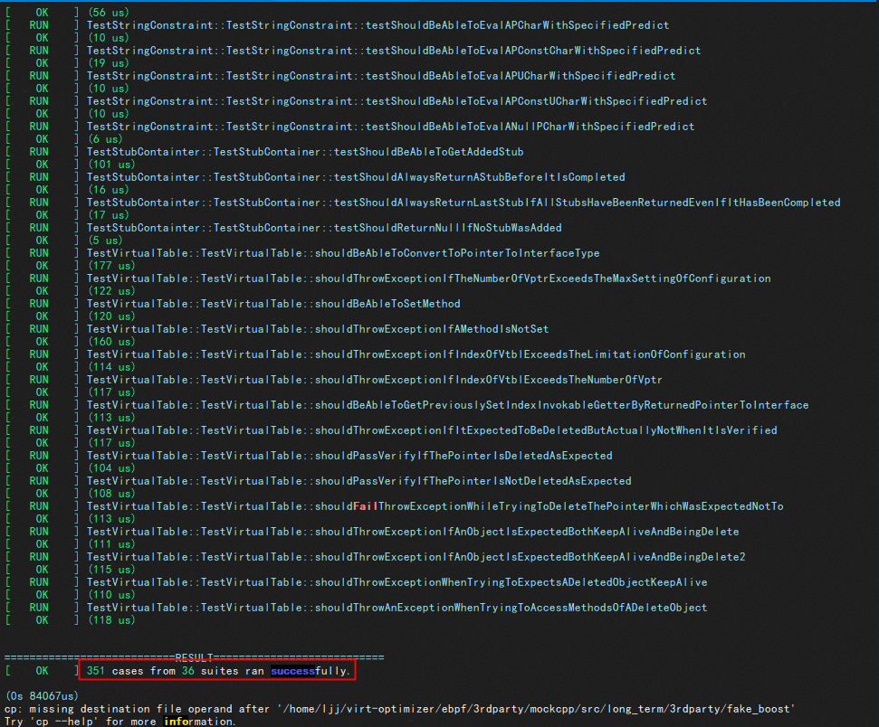

# 单元测试开发指南

## 前置动作

### 环境依赖

|环境项目|版本信息|
|:----|:----|
|推荐操作系统|openEuler 24.03 LTS SP4|
|CPU架构|支持 `x86_64` 和 `aarch64`|
|用户权限|安装与管理需 `root` 权限|
|软件要求|<ul><li>CMake ≥ 3.22.0</li><li>googletest ≥ 1.10.0</li><li>rapidjson ≥ 1.1.0</li><li>clang ≥ 12.0.1</li><li>libbpf-devel ≥ 0.8.1</li><li>bpftool ≥ 7.2.0</li></ul>|

> 覆盖率报告为可选能力。openEuler 24.03 LTS SP4 默认软件源不提供 `lcov` 软件包。若环境中已有 `lcov` 和 `genhtml` 命令，`run_ut.sh` 会生成覆盖率报告；否则脚本会跳过报告生成，不影响单元测试执行。

### 拉取工程文件

1. 拉取ubs-optimizer，进入virt-optimizer目录。

    ```bash
    git clone https://gitcode.com/openeuler/ubs-virt.git
    cd ubs-virt/virt-optimizer
    ```

### 进行UT开发及验证

1. 新增 UT 代码，并上传至环境中的 `virt-optimizer/ebpf/tests/` 目录下。

2. 进入virt-optimizer目录，执行以下命令，完成基本的debug包编译

    ```bash
    find . -type f -not -path '*/\.*' -exec grep -Il '.' {} \; | xargs -d '\n' -L 1 dos2unix -k
    bash build.sh -t debug
    ```

3. 进入到virt-optimizer/ebpf/目录执行以下命令，运行UT，获取UT运行情况

    ```bash
    bash run_ut.sh
    ```
    
    执行示例如下:

    
